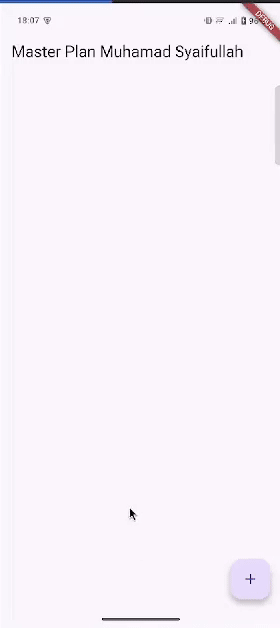
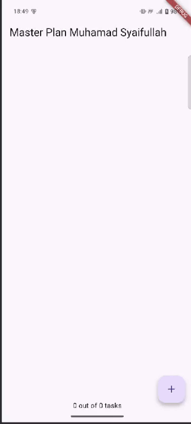
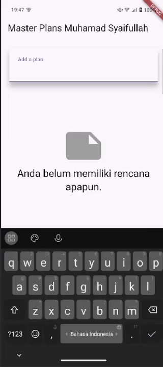

# Tugas Praktikum 1: Dasar State dengan Model-View

## 1. Selesaikan langkah-langkah praktikum tersebut, lalu dokumentasikan berupa GIF hasil akhir praktikum beserta penjelasannya di file README.md! Jika Anda menemukan ada yang error atau tidak berjalan dengan baik, silakan diperbaiki.
### Langkah 1: Buat Project Baru

### Langkah 2: Membuat model **`task.dart`**
```dart
class Task {
  final String description;
  final bool complete;

  const Task({this.complete = false, this.description = ''});
}
```
### Langkah 3: Buat file **`plan.dart`**
```dart
import './task.dart';

class Plan {
  final String name;
  final List<Task> tasks;

  const Plan({this.name = '', this.tasks = const []});
}
```
### Langkah 4: Buat file **`data_layer.dart`**
```dart
export 'plan.dart';  
export 'task.dart';
```
### Langkah 5: Pindah ke file **`main.dart`**
```dart
import 'package:flutter/material.dart';
import './views/plan_screen.dart';

void main() => runApp(MasterPlanApp());

class MasterPlanApp extends StatelessWidget {
  const MasterPlanApp({super.key});

  @override
  Widget build(BuildContext context) {
    return MaterialApp(
      theme: ThemeData(primarySwatch: Colors.purple),
      home: PlanScreen(),
    );
  }
}
```
### Langkah 6: buat **`plan_screen.dart`**
```dart
import '../models/data_layer.dart';
import 'package:flutter/material.dart';

class PlanScreen extends StatefulWidget {
  const PlanScreen({super.key});

  @override
  State createState() => _PlanScreenState();
}

class _PlanScreenState extends State<PlanScreen> {
  Plan plan = const Plan();

  @override
  Widget build(BuildContext context) {
    return Scaffold(
      appBar: AppBar(title: const Text('Master Plan Muhamad Syaifullah')),
      body: _buildList(),
      floatingActionButton: _buildAddTaskButton(),
    );
  }
}
```
### Langkah 7: buat method **`_buildAddTaskButton()`**
```dart
Widget _buildAddTaskButton() {  
  return FloatingActionButton(  
    child: const Icon(Icons.add),  
    onPressed: () {  
      setState(() {  
        plan = Plan(  
          name: plan.name,  
          tasks: List<Task>.from(plan.tasks)..add(const Task()),  
        );  
      });  
    },  
  );  
}
```
### Langkah 8: buat widget **`_buildList()`**
```dart
Widget _buildList() {  
  return ListView.builder(  
    itemCount: plan.tasks.length,  
    itemBuilder: (context, index) => _buildTaskTile(plan.tasks[index], index),  
  );  
}
```
### Langkah 9: buat widget **`_buildTaskTile`**
```dart
Widget _buildTaskTile(Task task, int index) {  
  return ListTile(  
    leading: Checkbox(  
      value: task.complete,  
      onChanged: (selected) {  
        setState(() {  
          plan = Plan(  
            name: plan.name,  
            tasks: List<Task>.from(plan.tasks)  
              ..[index] = Task(  
                description: task.description,  
                complete: selected ?? false,  
              ),  
          );  
        });  
      },  
    ),  
    title: TextFormField(  
      initialValue: task.description,  
      onChanged: (text) {  
        setState(() {  
          plan = Plan(  
            name: plan.name,  
            tasks: List<Task>.from(plan.tasks)  
              ..[index] = Task(description: text, complete: task.complete),  
          );  
        });  
      },  
    ),  
  );  
}
```
### **Langkah 10: Tambah Scroll Controller**
```dart
class _PlanScreenState extends State<PlanScreen> {  
  Plan plan = const Plan();  
  late ScrollController scrollController;
  ...
  }
```
### **Langkah 11: Tambah Scroll Listener**
```dart
@override  
void initState() {  
  super.initState();  
  scrollController = ScrollController()  
    ..addListener(() {  
      FocusScope.of(context).requestFocus(FocusNode());  
    });  
}
```
### **Langkah 12: Tambah controller dan keyboard behavior**
```dart
Widget _buildList() {  
  return ListView.builder(  
    controller: scrollController,  
    keyboardDismissBehavior: Theme.of(context).platform == TargetPlatform.iOS  
        ? ScrollViewKeyboardDismissBehavior.onDrag  
        : ScrollViewKeyboardDismissBehavior.manual,  
    itemCount: plan.tasks.length,  
    itemBuilder: (context, index) => _buildTaskTile(plan.tasks[index], index),  
  );  
}
```
### **Langkah 13: Terakhir, tambah method dispose()**
```dart
@override  
void dispose() {  
  scrollController.dispose();  
  super.dispose();  
}
```
### **Langkah 14: Hasil**


## 2. Jelaskan maksud dari langkah 4 pada praktikum tersebut! Mengapa dilakukan demikian?
* Membungkus beberapa data layer ke dalam sebuah file yang nanti akan mengekspor kedua model tersebut. Dengan begitu, proses impor akan lebih ringkas seiring berkembangnya aplikasi. Buat file bernama `data_layer.dart` di folder **models**. Kodenya hanya berisi `export` dari **models** lain.
## 3. Mengapa perlu variabel plan di langkah 6 pada praktikum tersebut? Mengapa dibuat konstanta ?
* Variabel `plan` diperlukan untuk menyimpan dan mengelola seluruh data rencana dan daftar tugasnya yang ditampilkan di layar, dan dibuat `const` pada awalnya sebagai inisialisasi objek kosong yang efisien.
## 4. Lakukan capture hasil dari Langkah 9 berupa GIF, kemudian jelaskan apa yang telah Anda buat!

* Memuat todo list
## 5. Apa kegunaan method pada Langkah 11 dan 13 dalam lifecyle state ?
* Langkah 11 (`initState`): Metode ini berfungsi untuk melakukan inisialisasi satu kali saat widget pertama kali dibuat dan dimasukkan ke dalam pohon widget. Dalam kode ini, `initState` digunakan untuk membuat objek `ScrollController` dan menambahkan listener (pendengar) padanya. Listener ini akan menghilangkan fokus dari `TextFormField` (sehingga keyboard menutup) setiap kali pengguna melakukan scroll pada daftar.
* Langkah 13 (`dispose`): Metode ini berfungsi untuk membersihkan sumber daya (resources) yang digunakan oleh state sebelum widget dihancurkan dan dihapus dari pohon widget. Dalam kasus ini, `dispose` memanggil `scrollController.dispose()` untuk melepaskan memori yang digunakan oleh `ScrollController` tersebut, mencegah kebocoran memori (memory leaks).
## 6. Kumpulkan laporan praktikum Anda berupa link commit atau repository GitHub ke dosen yang telah disepakati !


# Tugas Praktikum 2: InheritedWidget
## 1. Selesaikan langkah-langkah praktikum tersebut, lalu dokumentasikan berupa GIF hasil akhir praktikum beserta penjelasannya di file `README.md`! Jika Anda menemukan ada yang error atau tidak berjalan dengan baik, silakan diperbaiki sesuai dengan tujuan aplikasi tersebut dibuat.
### Langkah 1: Buat file **`plan_provider.dart`**
```dart
import 'package:flutter/material.dart';  
import '../models/data_layer.dart';  
  
class PlanProvider extends InheritedNotifier<ValueNotifier<Plan>> {  
  const PlanProvider({  
    super.key,  
    required Widget child,  
    required ValueNotifier<Plan> notifier,  
  }) : super(child: child, notifier: notifier);  
  
  static ValueNotifier<Plan> of(BuildContext context) {  
    return context  
        .dependOnInheritedWidgetOfExactType<PlanProvider>()!  
        .notifier!;  
  }  
}
```
### Langkah 2: Edit **`main.dart`**
```dart
@override  
Widget build(BuildContext context) {  
  return MaterialApp(  
    theme: ThemeData(primarySwatch: Colors.purple),  
    home: PlanProvider(  
      notifier: ValueNotifier<Plan>(const Plan()),  
      child: const PlanScreen(),  
    ),  
  );  
}
```
### Langkah 3: Tambah method pada model **`plan.dart`**
```dart
class Plan {  
  final String name;  
  final List<Task> tasks;  
  
  int get completedCount => tasks.where((task) => task.complete).length;  
  
  String get completenessMessage =>  
      '$completedCount out of ${tasks.length} tasks';  
  
  const Plan({this.name = '', this.tasks = const []});  
}
```
### **Langkah 4: Pindah ke PlanScreen**
* Edit `PlanScreen` agar menggunakan data dari `PlanProvider`. Hapus deklarasi variabel `plan` (ini akan membuat error). Kita akan perbaiki pada langkah 5 berikut ini.
### Langkah 5: Edit method **`_buildAddTaskButton`**
```dart
Widget _buildAddTaskButton(BuildContext context) {  
  ValueNotifier<Plan> planNotifier = PlanProvider.of(context);  
  return FloatingActionButton(  
    child: const Icon(Icons.add),  
    onPressed: () {  
      Plan currentPlan = planNotifier.value;  
      planNotifier.value = Plan(  
        name: currentPlan.name,  
        tasks: List<Task>.from(currentPlan.tasks)..add(const Task()),  
      );  
    },  
  );  
}
```
### Langkah 6: Edit method **`_buildTaskTile`**
```dart
Widget _buildTaskTile(Task task, int index, BuildContext context) {  
  ValueNotifier<Plan> planNotifier = PlanProvider.of(context);  
  return ListTile(  
    leading: Checkbox(  
      value: task.complete,  
      onChanged: (selected) {  
        Plan currentPlan = planNotifier.value;  
        planNotifier.value = Plan(  
          name: currentPlan.name,  
          tasks: List<Task>.from(currentPlan.tasks)  
            ..[index] = Task(  
              description: task.description,  
              complete: selected ?? false,  
            ),  
        );  
      },  
    ),  
    title: TextFormField(  
      initialValue: task.description,  
      onChanged: (text) {  
        Plan currentPlan = planNotifier.value;  
        planNotifier.value = Plan(  
          name: currentPlan.name,  
          tasks: List<Task>.from(currentPlan.tasks)  
            ..[index] = Task(description: text, complete: task.complete),  
        );  
      },  
    ),  
  );  
}
```
### Langkah 7: Edit **`_buildList`**
```dart
Widget _buildList(Plan plan) {  
  return ListView.builder(  
    controller: scrollController,  
    itemCount: plan.tasks.length,  
    itemBuilder: (context, index) =>  
        _buildTaskTile(plan.tasks[index], index, context),  
  );  
}
```
### Langkah 8: Tetap di **`class PlanScreen`**
### Langkah 9: Tambah widget **`SafeArea`**
```dart
@override  
Widget build(BuildContext context) {  
  return Scaffold(  
    appBar: AppBar(title: const Text('Master Plan Muhamad Syaifullah')),  
    body: ValueListenableBuilder<Plan>(  
      valueListenable: PlanProvider.of(context),  
      builder: (context, plan, child) {  
        return Column(  
          children: [  
            Expanded(child: _buildList(plan)),  
            SafeArea(child: Text(plan.completenessMessage)),  
          ],  
        );  
      },  
    ),  
    floatingActionButton: _buildAddTaskButton(context),  
  );  
}
```
## 2. Jelaskan mana yang dimaksud `InheritedWidget` pada langkah 1 tersebut! Mengapa yang digunakan `InheritedNotifier`?
1. `InheritedWidget`: Untuk menyebarkan (`provide`) data ke seluruh pohon widget di bawahnya.
2. `ValueNotifier`: Untuk menyimpan data (`Plan`) dan memberi tahu "siapa pun yang mendengarkan" ketika data tersebut berubah.
Dengan menggabungkan keduanya, `PlanProvider` menjadi cara yang efisien untuk tidak hanya menyediakan akses ke data `Plan`, tetapi juga secara otomatis memperbarui UI di mana pun data itu digunakan setiap kali ada perubahan. Ini adalah bentuk sederhana dari state management reaktif di Flutter.
## 3. Jelaskan maksud dari method di langkah 3 pada praktikum tersebut! Mengapa dilakukan demikian?
1. `.int get completedCount`:
	* Maksud: `Getter` ini secara dinamis menghitung dan mengembalikan jumlah tugas yang telah ditandai selesai (`complete = true`) dari dalam daftar tasks.
	* Cara Kerja: Ia menyaring daftar tasks untuk hanya menyertakan tugas yang sudah selesai, lalu menghitung panjang dari hasil saringan tersebut.
2. `String get completenessMessage`:
	* Maksud: `Getter` ini membuat sebuah pesan ringkasan dalam format `String` yang menunjukkan progres penyelesaian tugas, contohnya "3 out of 5 tasks".
	* Cara Kerja: Ia menggunakan nilai dari `completedCount` dan jumlah total `tasks` untuk membangun sebuah kalimat yang mudah dibaca.
## 4. Lakukan capture hasil dari Langkah 9 berupa GIF, kemudian jelaskan apa yang telah Anda buat!

## 5. Kumpulkan laporan praktikum Anda berupa link commit atau repository GitHub ke dosen yang telah disepakati !

# Tugas Praktikum 3: State di Multiple Screens
## 1. Selesaikan langkah-langkah praktikum tersebut, lalu dokumentasikan berupa GIF hasil akhir praktikum beserta penjelasannya di file `README.md`! Jika Anda menemukan ada yang error atau tidak berjalan dengan baik, silakan diperbaiki sesuai dengan tujuan aplikasi tersebut dibuat.
### Langkah 1: Edit **`PlanProvider`**
```dart
class PlanProvider extends InheritedNotifier<ValueNotifier<List<Plan>>> {  
  const PlanProvider({  
    super.key,  
    required Widget child,  
    required ValueNotifier<List<Plan>> notifier,  
  }) : super(child: child, notifier: notifier);  
  
  static ValueNotifier<List<Plan>> of(BuildContext context) {  
    return context  
        .dependOnInheritedWidgetOfExactType<PlanProvider>()!  
        .notifier!;  
  }  
}
```
### Langkah 2: Edit **`main.dart`**
```dart
@override  
Widget build(BuildContext context) {  
  return PlanProvider(  
    notifier: ValueNotifier<List<Plan>>(const []),  
    child: MaterialApp(  
      title: 'State management app',  
      theme: ThemeData(primarySwatch: Colors.blue),  
      home: const PlanScreen(),  
    ),  
  );  
}
```
### Langkah 3: Edit **`plan_screen.dart`**
```dart
class PlanScreen extends StatefulWidget {  
  final Plan plan;  
  const PlanScreen({super.key, required this.plan});  
  
  @override  
  State createState() => _PlanScreenState();  
}
```
### Langkah 4: Error
### Langkah 5: Tambah **`getter Plan`**
```dart
class _PlanScreenState extends State<PlanScreen> {  
  late ScrollController scrollController;  
  Plan get plan => widget.plan;
  ...
}
```
### Langkah 6: Method **`initState()`**
```dart
@override
void initState() {
   super.initState();
   scrollController = ScrollController()
    ..addListener(() {
      FocusScope.of(context).requestFocus(FocusNode());
    });
}
```
### Langkah 7: Widget **`build`**
```dart
@override  
Widget build(BuildContext context) {  
  ValueNotifier<List<Plan>> plansNotifier = PlanProvider.of(context);  
  
  return Scaffold(  
    appBar: AppBar(title: Text(_plan.name)),  
    body: ValueListenableBuilder<List<Plan>>(  
      valueListenable: plansNotifier,  
      builder: (context, plans, child) {  
        Plan currentPlan = plans.firstWhere((p) => p.name == plan.name);  
        return Column(  
          children: [  
            Expanded(child: _buildList(currentPlan)),  
            SafeArea(child: Text(currentPlan.completenessMessage)),  
          ],  
        );  
      },  
    ),  
    floatingActionButton: _buildAddTaskButton(context),  
  );  
}  
  
Widget _buildAddTaskButton(BuildContext context) {  
  ValueNotifier<List<Plan>> planNotifier = PlanProvider.of(context);  
  return FloatingActionButton(  
    child: const Icon(Icons.add),  
    onPressed: () {  
      Plan currentPlan = plan;  
      int planIndex = planNotifier.value.indexWhere(  
        (p) => p.name == currentPlan.name,  
      );  
      List<Task> updatedTasks = List<Task>.from(currentPlan.tasks)  
        ..add(const Task());  
      planNotifier.value = List<Plan>.from(planNotifier.value)  
        ..[planIndex] = Plan(name: currentPlan.name, tasks: updatedTasks);  
      plan = Plan(name: currentPlan.name, tasks: updatedTasks);  
    },  
  );  
}
```
### Langkah 8: Edit **`_buildTaskTile`**
```dart
Widget _buildTaskTile(Task task, int index, BuildContext context) {  
  ValueNotifier<List<Plan>> planNotifier = PlanProvider.of(context);  
  
  return ListTile(  
    leading: Checkbox(  
      value: task.complete,  
      onChanged: (selected) {  
        Plan currentPlan = plan;  
        int planIndex = planNotifier.value.indexWhere(  
          (p) => p.name == currentPlan.name,  
        );  
        planNotifier.value = List<Plan>.from(planNotifier.value)  
          ..[planIndex] = Plan(  
            name: currentPlan.name,  
            tasks: List<Task>.from(currentPlan.tasks)  
              ..[index] = Task(  
                description: task.description,  
                complete: selected ?? false,  
              ),  
          );  
      },  
    ),  
    title: TextFormField(  
      initialValue: task.description,  
      onChanged: (text) {  
        Plan currentPlan = plan;  
        int planIndex = planNotifier.value.indexWhere(  
          (p) => p.name == currentPlan.name,  
        );  
        planNotifier.value = List<Plan>.from(planNotifier.value)  
          ..[planIndex] = Plan(  
            name: currentPlan.name,  
            tasks: List<Task>.from(currentPlan.tasks)  
              ..[index] = Task(description: text, complete: task.complete),  
          );  
      },  
    ),  
  );  
}
```
### Langkah 9: Buat screen baru
`plan_creator_screen.dart`
```dart
import 'package:flutter/material.dart';  
  
class PlanCreatorScreen extends StatefulWidget {  
  const PlanCreatorScreen({super.key});  
  
  @override  
  State<PlanCreatorScreen> createState() => _PlanCreatorScreenState();  
}  
  
class _PlanCreatorScreenState extends State<PlanCreatorScreen> {  
  @override  
  Widget build(BuildContext context) {  
    return const Placeholder();  
  }  
}
```
``main.dart``
```dart
@override  
Widget build(BuildContext context) {  
  return PlanProvider(  
    notifier: ValueNotifier<List<Plan>>(const []),  
    child: MaterialApp(  
      title: 'State management app',  
      theme: ThemeData(primarySwatch: Colors.blue),  
      home: const PlanCreatorScreen(),  
    ),  
  );  
}
```
### Langkah 10: Pindah ke class **`_PlanCreatorScreenState`**
```dart
class _PlanCreatorScreenState extends State<PlanCreatorScreen> {  
  final textController = TextEditingController();  
  
  @override  
  void dispose() {  
    textController.dispose();  
    super.dispose();  
  }  
    
  @override  
  Widget build(BuildContext context) {  
    return const Placeholder();  
  }  
}
```
### Langkah 11: Pindah ke method build
```dart
@override  
Widget build(BuildContext context) {  
  return Scaffold(  
    appBar: AppBar(title: const Text('Master Plans Muhamad Syaifullah')),  
    body: Column(children: [  
      _buildListCreator(),  
      Expanded(child: _buildMasterPlans())  
    ]),  
  );  
}
```
### Langkah 12: Buat widget **`_buildListCreator`**
```dart
Widget _buildListCreator() {  
  return Padding(  
    padding: const EdgeInsets.all(20.0),  
    child: Material(  
      color: Theme.of(context).cardColor,  
      elevation: 10,  
      child: TextField(  
        controller: textController,  
        decoration: const InputDecoration(  
          labelText: 'Add a plan',  
          contentPadding: EdgeInsets.all(20),  
        ),  
        onEditingComplete: addPlan,  
      ),  
    ),  
  );  
}
```
### Langkah 13: Buat **`void addPlan()`**
```dart
void addPlan() {  
  final text = textController.text;  
  if (text.isEmpty) {  
    return;  
  }  
  final plan = Plan(name: text, tasks: []);  
  ValueNotifier<List<Plan>> planNotifier = PlanProvider.of(context);  
  planNotifier.value = List<Plan>.from(planNotifier.value)..add(plan);  
  textController.clear();  
  FocusScope.of(context).requestFocus(FocusNode());  
  setState(() {});  
}
```
### Langkah 14: Buat **`widget _buildMasterPlans()`**
```dart
Widget _buildMasterPlans() {  
  ValueNotifier<List<Plan>> planNotifier = PlanProvider.of(context);  
  List<Plan> plans = planNotifier.value;  
  
  if (plans.isEmpty) {  
    return Column(  
      mainAxisAlignment: MainAxisAlignment.center,  
      children: <Widget>[  
        const Icon(Icons.note, size: 100, color: Colors.grey),  
        Text(  
          'Anda belum memiliki rencana apapun.',  
          style: Theme.of(context).textTheme.headlineSmall,  
        ),  
      ],  
    );  
  }  
  return ListView.builder(  
    itemCount: plans.length,  
    itemBuilder: (context, index) {  
      final plan = plans[index];  
      return ListTile(  
        title: Text(plan.name),  
        subtitle: Text(plan.completenessMessage),  
        onTap: () {  
          Navigator.of(  
            context,  
          ).push(MaterialPageRoute(builder: (_) => PlanScreen(plan: plan)));  
        },  
      );  
    },  
  );  
}
```
## 2. Berdasarkan Praktikum 3 yang telah Anda lakukan, jelaskan maksud dari gambar diagram berikut ini!


diagram tersebut menjelaskan alur kerja aplikasi:
1. Aplikasi dimulai dengan `PlanCreatorScreen` yang ditampilkan, di mana semua data disediakan oleh `PlanProvider` yang berada di tingkat atas.
2. Ketika pengguna melakukan aksi `Navigator.push` (misalnya, memilih sebuah rencana), `PlanScreen` yang baru akan dibuat dan ditampilkan.
3. `PlanScreen` yang baru ini, meskipun merupakan layar yang berbeda, tetap dapat mengakses data yang sama dari `PlanProvider` karena `PlanProvider` berada di posisi yang lebih tinggi dalam pohon widget, di atas kedua layar tersebut.

## 3. Lakukan capture hasil dari Langkah 14 berupa GIF, kemudian jelaskan apa yang telah Anda buat!

## 4. Kumpulkan laporan praktikum Anda berupa link commit atau repository GitHub ke dosen yang telah disepakati !