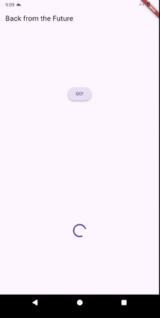
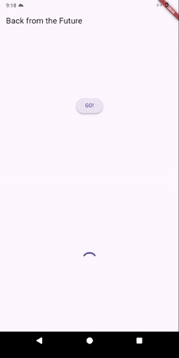
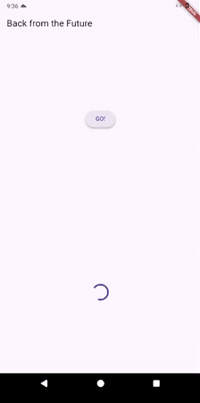
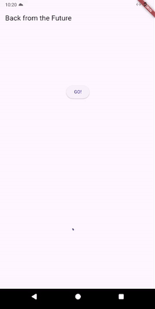
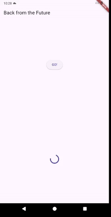
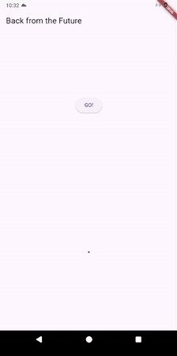

## Praktikum 1: Mengunduh Data dari Web Service (API)
### Langkah 1: Buat Project Baru
create new project
```bash
flutter create books
```
http
```bash
flutter pub add http
```
### Langkah 2: Cek file `pubspec.yaml`
```yaml
dependencies:
  flutter:
    sdk: flutter
  http: ^1.1.0
```
### Langkah 3: Buka file `main.dart`
>  **Soal 1**
> 
>Tambahkan **nama panggilan Anda** pada `title` app sebagai identitas hasil pekerjaan Anda.

```dart
import 'dart:async';
import 'package:flutter/material.dart';
import 'package:http/http.dart' as http;

void main() {
  runApp(const MainApp());
}

class MainApp extends StatelessWidget {
  const MainApp({super.key});

  @override
  Widget build(BuildContext context) {
    return MaterialApp(
      title: 'Syaiful',
      theme: ThemeData(
        primaryColor: Colors.blue,
        visualDensity: VisualDensity.adaptivePlatformDensity,
      ),
      home: const FuturePage(),
    );
  }
}

class FuturePage extends StatefulWidget {
  const FuturePage({super.key});

  @override
  State<FuturePage> createState() => _FuturePageState();
}

class _FuturePageState extends State<FuturePage> {
  String result = '';
  @override
  Widget build(BuildContext context) {
    return Scaffold(
      appBar: AppBar(title: const Text('Back from the Future')),
      body: Center(
        child: Column(
          children: [
            const Spacer(),
            ElevatedButton(onPressed: () {}, child: const Text('GO!')),
            const Spacer(),
            Text(result),
            const Spacer(),
            const CircularProgressIndicator(),
            const Spacer(),
          ],
        ),
      ),
    );
  }
}
```
### Langkah 4: Tambah method `getData()`
```dart
  Future<Response> getData() async {
    const authority = 'www.googleapis.com';
    const path = '/books/v1/volumes/qBFhEAAAQBAJ';
    Uri url = Uri.https(authority, path);
    return await http.get(url);
  }
```
> **Soal 2**
>
> - Carilah judul buku favorit Anda di Google Books, lalu ganti ID buku pada variabel `path` di kode tersebut. Caranya ambil di URL browser Anda seperti gambar berikut ini.
> - https://www.googleapis.com/books/v1/volumes/qBFhEAAAQBAJ
### Langkah 5: Tambah kode di `ElevatedButton`
```dart
ElevatedButton(
  onPressed: () {
    setState(() {});
    getData()
        .then((value) {
          result = value.body.toString().substring(0, 450);
          setState(() {});
        })
        .catchError((_) {
          result = 'An error occurred';
          setState(() {});
        });
  },
  child: const Text('GO!'),
),
```
> **Soal 3**
> 
> - Jelaskan maksud kode langkah 5 tersebut terkait `substring` dan `catchError`!
>   - Hanya mengambil data dari 0 sampai 450.
>   - Menangkap error jika terjadi.
> - Capture hasil praktikum Anda berupa GIF dan lampirkan di README. Lalu lakukan commit dengan pesan "**W11: Soal 3**".



## Praktikum 2: Menggunakan await/async untuk menghindari callbacks
### Langkah 1: Buka file `main.dart`
```dart
Future<int> returnOneAsync() async {
  await Future.delayed(const Duration(seconds: 3));
  return 1;
}

Future<int> returnTwoAsync() async {
  await Future.delayed(const Duration(seconds: 3));
  return 2;
}

Future<int> returnThreeAsync() async {
  await Future.delayed(const Duration(seconds: 3));
  return 3;
}
```
### Langkah 2: Tambah method `count()`
```dart
Future count() async {
  int total = 0;
  total = await returnOneAsync();
  total += await returnTwoAsync();
  total += await returnThreeAsync();
  setState(() {
    result = total.toString();
  });
}
```
### Langkah 3: Panggil `count()`
```dart
ElevatedButton(
  onPressed: () {
    count();
  },
  child: const Text('GO!'),
),
```
### Langkah 4: Run
>**Soal 4**
>
> - Jelaskan maksud kode langkah 1 dan 2 tersebut!
>   - Mendemonstrasikan penggunaan await/async yang mana akan menghasilkan nilai 6.
> - Capture hasil praktikum Anda berupa GIF dan lampirkan di README. Lalu lakukan commit dengan pesan "**W11: Soal 4**".



## Praktikum 3: Menggunakan Completer di Future
### Langkah 1: Buka `main.dart`
```dart
import 'package:async/async.dart';
```
### Langkah 2: Tambahkan variabel dan method
```dart
late Completer completer;

Future getNumber() {
  completer = Completer<int>();
  calculate();
  return completer.future;
}

Future calculate() async {
  await Future.delayed(const Duration(seconds: 5));
  completer.complete(42);
}
```
### Langkah 3: Ganti isi kode `onPressed()`
```dart
ElevatedButton(
  onPressed: () {
    getNumber().then((value) {
      setState(() {
        result = value.toString();
      });
    });
  },
  child: const Text('GO!'),
),
```
### Langkah 4:
> **Soal 5**
>
> - Jelaskan maksud kode langkah 2 tersebut!
>   - Kode tersebut mendemonstrasikan penggunaan Completer untuk mengontrol completion (penyelesaian) sebuah Future secara manual.
> - Capture hasil praktikum Anda berupa GIF dan lampirkan di README. Lalu lakukan commit dengan pesan "W11: Soal 5".


### Langkah 5: Ganti method `calculate()`
```dart
Future calculate() async {
  try {
    await Future.delayed(const Duration(seconds: 5));
    completer.complete(42);
  } catch (_) {
    completer.completeError({});
  }
}
```

### Langkah 6: Pindah ke `onPressed()`
```dart
ElevatedButton(
  onPressed: () {
    getNumber()
        .then((value) {
          setState(() {
            result = value.toString();
          });
        })
        .catchError((e) {
          result = 'An error occurred';
        });
  },
  child: const Text('GO!'),
),
```
> Soal 6
>
> - Jelaskan maksud perbedaan kode langkah 2 dengan langkah 5-6 tersebut!
>    - Penggunaan try catch jika terjadi error
> - Capture hasil praktikum Anda berupa GIF dan lampirkan di README. Lalu lakukan commit dengan pesan "W11: Soal 6".




## Praktikum 4: Memanggil Future secara paralel
### Langkah 1: Buka file `main.dart`
```dart
void returnFG(){
  FutureGroup<int> futureGroup = FutureGroup<int>();
  futureGroup.add(returnOneAsync());
  futureGroup.add(returnTwoAsync());
  futureGroup.add(returnThreeAsync());
  futureGroup.close();
  futureGroup.future.then((List<int> value) {
    int total = 0;
    for (var element in value){
      total += element;
    }
    setState(() {
      result = total.toString();
    });
  });
}
```

### Langkah 2: Edit `onPressed()`
```dart
onPressed: () {
    returnFG();
}
```

### Langkah 3: Run
> **Soal 7**
>
> - Capture hasil praktikum Anda berupa GIF dan lampirkan di README. Lalu lakukan commit dengan pesan "W11: Soal 7".



### Langkah 4: Ganti variabel `futureGroup`
```dart
final futures = Future.wait<int>([
  returnOneAsync(),
  returnTwoAsync(),
  returnThreeAsync(),
]);
futures.then((List<int> value) {
  int total = 0;
  for (var element in value) {
    total += element;
  }
  setState(() {
    result = total.toString();
  });
});
```
> Soal 8
>
> - Jelaskan maksud perbedaan kode langkah 1 dan 4!
>   - implementasi future secara pararel untuk menghemat waktu

## Praktikum 5: Menangani Respon Error pada Async Code
### Langkah 1: Buka file `main.dart`
```dart
Future returnError() async {
  await Future.delayed(const Duration(seconds: 2));
  throw Exception('Something terrible happened!');
}
```

### Langkah 2: ElevatedButton
```dart
returnError()
  .then((value) {
    setState(() {
      result = 'Success';
    });
  })
  .catchError((e) {
    setState(() {
      result = e.toString();
    });
  }).whenComplete(() => print('Operation finished'));
```

### Langkah 3: Run
> **Soal 9**
>
> - Capture hasil praktikum Anda berupa GIF dan lampirkan di README. Lalu lakukan commit dengan pesan "W11: Soal 9".



### Langkah 4: Tambah method `handleError()`
```dart
Future handleError() async {
  try {
    await returnError();
  } catch (e) {
    setState(() {
      result = e.toString();
    });
  } finally {
    print('Operation finished');
  }
}
```
> Soal 10
>
> - Panggil method handleError() tersebut di ElevatedButton, lalu run. Apa hasilnya? Jelaskan perbedaan kode langkah 1 dan 4!



## Praktikum 6: Menggunakan Future dengan StatefulWidget
### Langkah 1: install plugin geolocator
```bash
flutter pub add geolocator
```

### Langkah 2: Tambah permission GPS
```xml
<uses-permission android:name="android.permission.ACCESS_FINE_LOCATION"/>
<uses-permission android:name="android.permission.ACCESS_COARSE_LOCATION"/>

```
### Langkah 3: Buat file `geolocation.dart`
```file
geolocation.dart
```
### Langkah 4: Buat StatefulWidget
`class LocationScreen`
### Langkah 5: Isi kode `geolocation.dart`

### Langkah 6: Edit main.dart

### Langkah 7: Run

### Langkah 8: Tambahkan animasi loading


## Praktikum 7: Manajemen Future dengan FutureBuilder
### Langkah 1: Modifikasi method `getPosition()`

### Langkah 2: Tambah variabel

### Langkah 3: Tambah `initState()`

### Langkah 4: Edit method `build()`

### Langkah 5: Tambah handling error


## Praktikum 8: Navigation route dengan Future Function
### Langkah 1: Buat file baru `navigation_first.dart`

### Langkah 2: Isi kode `navigation_first.dart`

### Langkah 3: Tambah method di `class _NavigationFirstState`

### Langkah 4: Buat file baru `navigation_second.dart`

### Langkah 5: Buat class NavigationSecond dengan StatefulWidget

### Langkah 6: Edit `main.dart`

### Langkah 8: Run


## Praktikum 9: Memanfaatkan async/await dengan Widget Dialog
### Langkah 1: Buat file baru `navigation_dialog.dart`

### Langkah 2: Isi kode `navigation_dialog.dart`

### Langkah 3: Tambah method async

### Langkah 4: Panggil method di `ElevatedButton`

### Langkah 5: Edit `main.dart`

### Langkah 6: Run
