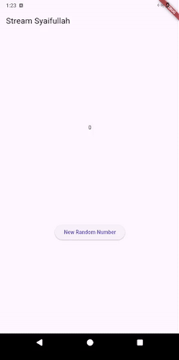
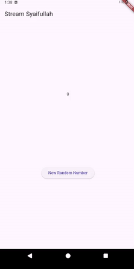
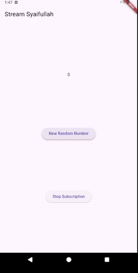
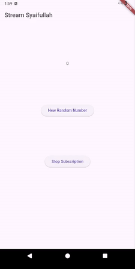
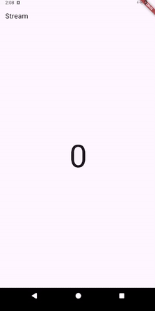
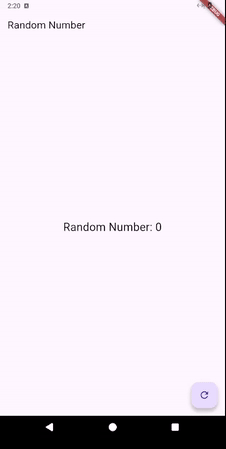

# Praktikum 1: Dart Streams
### **Langkah 1: Buat Project Baru**

### Langkah 2: Buka file **`main.dart`**
```dart
import 'package:flutter/material.dart';

void main() {
  runApp(const MyApp());
}

class MyApp extends StatelessWidget {
  const MyApp({super.key});

  @override
  Widget build(BuildContext context) {
    return MaterialApp(
      title: 'Syaifullah',
      theme: ThemeData(
        primarySwatch: Colors.blue,
      ),
      home: const StreamHomePage(),
    );
  }
}

class StreamHomePage extends StatefulWidget {
  const StreamHomePage({super.key});

  @override
  State<StreamHomePage> createState() => _StreamHomePageState();
}

class _StreamHomePageState extends State<StreamHomePage> {
  @override
  Widget build(BuildContext context) {
    return Container();
  }
}
```

>Soal 1
>
> - Tambahkan nama panggilan Anda pada title app sebagai identitas hasil pekerjaan Anda.
> - Gantilah warna tema aplikasi sesuai kesukaan Anda.
> - Lakukan commit hasil jawaban Soal 1 dengan pesan "W12: Jawaban Soal 1"


### Langkah 3: Buat file baru **`stream.dart`**
```dart
import 'package:flutter/material.dart';

class ColorStream {

}
```

### Langkah 4: Tambah variabel **`colors`**
```dart
  final List<Color> colors = [
    Colors.blueGrey,
    Colors.amber,
    Colors.deepPurple,
    Colors.lightBlue,
    Colors.teal,
  ];
```
>Soal 2
>
> - Tambahkan 5 warna lainnya sesuai keinginan Anda pada variabel colors tersebut.
> - Lakukan commit hasil jawaban Soal 2 dengan pesan "W12: Jawaban Soal 2"


### Langkah 5: Tambah method **`getColors()`**
```dart
Stream<Color> getColors() async* {}
```

### Langkah 6: Tambah perintah **`yield*`**
```dart
yield* Stream.periodic(const Duration(seconds: 1), (int t) {
    int index = t % colors.length;
    return colors[index];
});
```
>Soal 3
>
> - Jelaskan fungsi keyword yield* pada kode tersebut!
>   - Berfungsi untuk meneruskan seluruh elemen dari stream lain ke dalam stream yang sedang dibangun. 
> - Apa maksud isi perintah kode tersebut?
>   - membuat sebuah stream yang mengirimkan data setiap detik.
> - Lakukan commit hasil jawaban Soal 3 dengan pesan "W12: Jawaban Soal 3"


### Langkah 7: Buka **`main.dart`**
```dart
import 'stream.dart';
```

### **Langkah 8: Tambah variabel**
```dart
  Color bgColor = Colors.blueGrey;
  late ColorStream colorStream;
```

### Langkah 9: Tambah method **`changeColor()`**
```dart
  void changeColor() async {
    await for (var eventColor in colorStream.getColors()) {
      setState(() {
        bgColor = eventColor;
      });
    }
  }
```

### **Langkah** 10: Lakukan override **`initState()`**
```dart
  @override
  void initState() {
    super.initState();
    colorStream = ColorStream();
    changeColor();
  }
```

### **Langkah** 11: Ubah isi **`Scaffold()`**
```dart
return Scaffold(
    appBar: AppBar(title: const Text('Stream Syaifullah')),
    body: Container(decoration: BoxDecoration(color: bgColor)),
);
```

### **Langkah 12: Run**
>Soal 4
>
> - Capture hasil praktikum Anda berupa GIF dan lampirkan di README.
> - Lakukan commit hasil jawaban Soal 4 dengan pesan "W12: Jawaban Soal 4"


### Langkah 13: Ganti isi method `changeColor()`
>Soal 5
>
> - Jelaskan perbedaan menggunakan listen dan await for (langkah 9) !
>   - 
> - Lakukan commit hasil jawaban Soal 5 dengan pesan "W12: Jawaban Soal 5"


# Praktikum 2: Stream controllers dan sinks
### Langkah 1: Buka file **`stream.dart`**
```dart
import 'dart:async';
```

### Langkah 2: Tambah **`class NumberStream`**
```dart
class NumberStream {
}
```

### Langkah 3: Tambah **`StreamController`**
```dart
final StreamController<int> controller = StreamController<int>();
```

### Langkah 4: Tambah method **`addNumberToSink`**
```dart
void addNumberToSink(int newNumber) {
  controller.sink.add(newNumber);
}
```

### Langkah 5: Tambah method **`close()`**
```dart
close() {
  controller.close();
}
```

### **Langkah** 6: Buka **`main.dart`**
```dart
import 'dart:async';
import 'dart:math';
```

### **Langkah** **7: Tambah variabel**
```dart
int lastNumber = 0;
late StreamController numberStreamController;
late NumberStream numberStream;
```

### Langkah 8: Edit **`initState()`**
```dart
@override
void initState() {
  numberStream = NumberStream();
  numberStreamController = numberStream.controller;
  Stream stream = numberStreamController.stream;
  stream.listen((event) {
    setState(() {
      lastNumber = event;
    });
  });
  super.initState();
}
```

### **Langkah 9: Edit dispose()**
```dart
@override
void dispose() {
  numberStreamController.close();
  super.dispose();
}
```

### Langkah 10: Tambah method **`addRandomNumber()`**
```dart
void addRandomNumber() {
  Random random = Random();
  int myNum = random.nextInt(10);
  numberStream.addNumberToSink(myNum);
}
```

### Langkah 11: Edit method **`build()`**
```dart
body: SizedBox(
  width: double.infinity,
  child: Column(
    mainAxisAlignment: MainAxisAlignment.spaceEvenly,
    crossAxisAlignment: CrossAxisAlignment.center,
    children: [
      Text(lastNumber.toString()),
      ElevatedButton(
        onPressed: () => addRandomNumber(),
        child: const Text('New Random Number'),
      )
    ],
  ),
),
```

### **Langkah 12: Run**
>Soal 6
>
> - Jelaskan maksud kode langkah 8 dan 10 tersebut!
>   - `initState` membuat objek NumberStream untuk pertama kali
>   - `addRandomNumber` fungsi mengacak angka
> - Capture hasil praktikum Anda berupa GIF dan lampirkan di README.
> - Lalu lakukan commit dengan pesan "W12: Jawaban Soal 6".



### Langkah 13: Buka **`stream.dart`**
```dart
addError() {
  controller.sink.addError('error');
}
```

### **Langkah 14: Buka main.dart**
```dart
@override
void initState() {
  numberStream = NumberStream();
  numberStreamController = numberStream.controller;
  Stream stream = numberStreamController.stream;
  stream.listen((event) {
    setState(() {
      lastNumber = event;
    });
  }).onError((error) {
    setState(() {
      lastNumber = -1;
    });
  });
  super.initState();
}
```

### **Langkah** 15: Edit method **`addRandomNumber()`**
```dart
void addRandomNumber() {
  Random random = Random();
  // int myNum = random.nextInt(10);
  // numberStream.addNumberToSink(myNum);
  numberStream.addError();
}
```
> Soal 7
>
> - Jelaskan maksud kode langkah 13 sampai 15 tersebut!
>   - handle error
>   - tes handdle error output -1
> - Kembalikan kode seperti semula pada Langkah 15, comment addError() agar Anda dapat melanjutkan ke praktikum 3 berikutnya.
```
  void addRandomNumber() {
    Random random = Random();
    int myNum = random.nextInt(10);
    numberStream.addNumberToSink(myNum);
    // numberStream.addError();
  }
```
> - Lalu lakukan commit dengan pesan "W12: Jawaban Soal 7".


# Praktikum 3: Injeksi data ke streams
### Langkah 1: Buka **`main.dart`**
```dart
late StreamTransformer transformer;
```

### Langkah 2: Tambahkan kode ini di **`initState`**
```dart
transformer = StreamTransformer<int, int>.fromHandlers(
  handleData: (value, sink) {
    sink.add(value * 10);
  },
  handleError: (error, trace, sink) {
    sink.add(-1);
  },
  handleDone: (sink) => sink.close(),
);
```
### Langkah 3: Tetap di **`initState`**
```dart
stream.transform(transformer).listen((event) {
  setState(() {
    lastNumber = event;
  });
}).onError((error) {
  setState(() {
    lastNumber = -1;
  });
});
```
### **Langkah 4: Run**
>Soal 8
>
> - Jelaskan maksud kode langkah 1-3 tersebut!
>   - Menerapkan pola data pipeline
> - Capture hasil praktikum Anda berupa GIF dan lampirkan di README.
> - Lalu lakukan commit dengan pesan "W12: Jawaban Soal 8".




# Praktikum 4: Subscribe ke stream events
### Langkah 1: Tambah variabel
```dart
late StreamSubscription subscription;
```

### Langkah 2: Edit **`initState()`**
```dart
subscription = stream.transform(transformer).listen((event) {
  setState(() {
    lastNumber = event;
  });
});
```

### Langkah 3: Tetap di **`initState()`**
```dart
subscription.onError((error) {
  setState(() {
    lastNumber = -1;
  });
});
```

### Langkah 4: Tambah properti onDone()
```dart
subscription.onDone(() {
  print('OnDone was called');
});
```

### **Langkah 5: Tambah method baru**
```dart
void stopStream() {
  numberStreamController.close();
}
```

### Langkah 6: Pindah ke method **`dispose()`**
```dart
@override
void dispose() {
  subscription.cancel();
  super.dispose();
}
```

### Langkah 7: Pindah ke method **`build()`**
```dart
ElevatedButton(
  onPressed: () => stopStream(),
  child: const Text('Stop Subscription'),
),
```

### Langkah 8: Edit method **`addRandomNumber()`**
```dart
void addRandomNumber() {
  Random random = Random();
  int myNum = random.nextInt(10);
  if (!numberStreamController.isClosed) {
    numberStream.addNumberToSink(myNum);
  } else {
    setState(() {
      lastNumber = -1;
    });
  }
}
```

### **Langkah 9: Run**

### Langkah 10: Tekan button ‘Stop Subscription'
> Soal 9
>
> - Jelaskan maksud kode langkah 2, 6 dan 8 tersebut!
>   - Hasil proses transformasi dan langganan stream disimpan ke dalam variabel `subscription` dengan tipe `StreamSubscription`.
>   - Pemanggilan `subscription.cancel()` guna memutus langganan terhadap stream saat widget `dispose()`.
>   - Menambah pengecekan.
> - Capture hasil praktikum Anda berupa GIF dan lampirkan di README.
> - Lalu lakukan commit dengan pesan "W12: Jawaban Soal 9".




# Praktikum 5: Multiple stream subscriptions
### Langkah 1: Buka file **`main.dart`**
```dart
late StreamSubscription subscription2;
String values = '';
```

### Langkah 2: Edit **`initState()`**
```dart
subscription2 = stream.listen((event) {
  setState(() {
    values += '$event - ';
  });
});
```

### **Langkah 3: Run**
>Soal 10
>
> - Jelaskan mengapa error itu bisa terjadi ?
>   - Exception `Bad state: Stream has already been listened to` muncul karena listener pertama `subscription` sudah mengikat stream, sehingga pembuatan listener kedua `subscription2` ditolak runtime agar tidak terjadi konflik.


### Langkah 4: Set broadcast stream
```dart
@override
void initState() {
  numberStream = NumberStream();
  numberStreamController = numberStream.controller;
  Stream stream = numberStreamController.stream.asBroadcastStream();
  ...
```

### Langkah 5: Edit method **`build()`**
```dart
children: [
  Text(lastNumber.toString()),
  ElevatedButton(
    onPressed: () => addRandomNumber(),
    child: const Text('New Random Number'),
  ),
  ElevatedButton(
    onPressed: () => stopStream(),
    child: const Text('Stop Subscription'),
  ),
  Text(values),
],
```

### **Langkah 6: Run**
>Soal 11
>
> - Jelaskan mengapa hal itu bisa terjadi ?
>   - Setelah `asBroadcastStream()` dijalankan, stream mengizinkan banyak subscriber sehingga setiap angka yang dikirim secara simultan diterima oleh kedua subscription. 
> - Capture hasil praktikum Anda berupa GIF dan lampirkan di README.
> - Lalu lakukan commit dengan pesan "W12: Jawaban Soal 10,11".



# Praktikum 6: StreamBuilder
### **Langkah 1: Buat Project Baru**

### Langkah 2: Buat file baru **`stream.dart`**
```dart
class NumberStream {}
```

### Langkah 3: Tetap di file **`stream.dart`**
```dart
Stream<int> getNumbers() async* {
  yield* Stream.periodic(const Duration(seconds: 1), (int t) {
    Random random = Random();
    int myNum = random.nextInt(10);
    return myNum;
  });
}
```

### **Langkah 4: Edit main.dart**
```dart
import 'package:flutter/material.dart';
import 'stream.dart';
import 'dart:async';

void main() {
  runApp(const MyApp());
}

class MyApp extends StatelessWidget {
  const MyApp({super.key});

  @override
  Widget build(BuildContext context) {
    return MaterialApp(
      title: 'Stream',
      theme: ThemeData(
        primarySwatch: Colors.deepPurple,
      ),
      home: const StreamHomePage(),
    );
  }
}

class StreamHomePage extends StatefulWidget {
  const StreamHomePage({super.key});

  @override
  State<StreamHomePage> createState() => _StreamHomePageState();
}

class _StreamHomePageState extends State<StreamHomePage> {
  @override
  Widget build(BuildContext context) {
    return Container();
  }
}
```

### Langkah 5: Tambah variabel
```dart
late Stream<int> numberStream;
```

### Langkah 6: Edit **`initState()`**
```dart
@override
void initState() {
  numberStream = NumberStream().getNumbers();
  super.initState();
}
```

### Langkah 7: Edit method **`build()`**
```dart
@override
Widget build(BuildContext context) {
  return Scaffold(
    appBar: AppBar(
      title: const Text('Stream'),
    ),
    body: StreamBuilder(
      stream: numberStream,
      initialData: 0,
      builder: (context, snapshot) {
        if (snapshot.hasError) {
          print('Error!');
        }
        if (snapshot.hasData) {
          return Center(
            child: Text(
              snapshot.data.toString(),
              style: const TextStyle(fontSize: 96),
            ),
          );
        } else {
          return const SizedBox.shrink();
        }
      },
    ),
  );
}
```

### **Langkah 8: Run**

>Soal 12
>
> - Jelaskan maksud kode pada langkah 3 dan 7 !
>   - Fungsi menghasilkan angka setiap detik
>   - Menampilkan angka setiap ada event baru
> - Capture hasil praktikum Anda berupa GIF dan lampirkan di README.
> - Lalu lakukan commit dengan pesan "W12: Jawaban Soal 12".




# Praktikum 7: BLoC Pattern
### Langkah 1: Buat Project baru

### Langkah 2: Isi kode **`random_bloc.dart`**
```dart
import 'dart:async';
import 'dart:math';
```

### Langkah 3: Buat **`class RandomNumberBloc()`**
```dart
class RandomNumberBloc {}
```

### Langkah 4: Buat variabel **`StreamController`**
```dart
// StreamController for input events
final _generateRandomController = StreamController<void>();
// StreamController for output
final _randomNumberController = StreamController<int>();
// Input Sink
Sink<void> get generateRandom => _generateRandomController.sink;
// Output Stream
Stream<int> get randomNumber => _randomNumberController.stream;
```

### **Langkah 5: Buat constructor**
```dart
RandomNumberBloc() {
  _generateRandomController.stream.listen((_) {
    final random = Random().nextInt(10);
    _randomNumberController.sink.add(random);
  });
}
```

### Langkah 6: Buat method **`dispose()`**
```dart
void dispose() {
  _generateRandomController.close();
  _randomNumberController.close();
}
```

### Langkah 7: Edit **`main.dart`**
```dart
class MyApp extends StatelessWidget {
  const MyApp({super.key});

  @override
  Widget build(BuildContext context) {
    return MaterialApp(
      title: 'Flutter Demo',
      theme: ThemeData(
        primarySwatch: Colors.blue,
      ),
      home: const RandomScreen(),
    );
  }
}
```

### Langkah 8: Buat file baru **`random_screen.dart`**

### Langkah 9: Lakukan impor material dan **`random_bloc.dart`**
```dart
import 'package:bloc_random_syaiful/random_bloc.dart';
import 'package:flutter/material.dart';
```

### **Langkah 10: Buat StatefulWidget RandomScreen**

### **Langkah 11: Buat variabel**
```dart
final _bloc = RandomNumberBloc();
```

### Langkah 12: Buat method **`dispose()`**
```dart
@override
void dispose() {
  _bloc.dispose();
  super.dispose();
}
```

### Langkah 13: Edit method **`build()`**
```dart
@override
  Widget build(BuildContext context) {
    return Scaffold(
      appBar: AppBar(title: const Text('Random Number')),
      body: Center(
        child: StreamBuilder<int>(
          stream: _bloc.randomNumber,
          initialData: 0,
          builder: (context, snapshot) {
            return Text(
              'Random Number: ${snapshot.data}',
              style: const TextStyle(fontSize: 24),
            );
          },
        ),
      ),
      floatingActionButton: FloatingActionButton(
        onPressed: () => _bloc.generateRandom.add(null),
        child: const Icon(Icons.refresh),
      ),
    );
  }
```

>Soal 13
>
> - Jelaskan maksud praktikum ini ! Dimanakah letak konsep pola BLoC-nya ?
>   - Input (Sink) - generateRandom
>     - Menerima event dari UI (tombol ditekan)
>     - Bersifat write-only untuk UI
>   - Output (Stream) - randomNumber
>     - Mengirim data ke UI
>     - Bersifat read-only dari UI
>   - Business Logic - Constructor
>     - Memproses event input
>     - Generate random number
>     - Mengirim hasil ke output stream
>   - UI Layer - StreamBuilder
>     - Hanya menampilkan data dari BLoC
>     - Tidak mengandung logika bisnis
> - Capture hasil praktikum Anda berupa GIF dan lampirkan di README.
> - Lalu lakukan commit dengan pesan "W12: Jawaban Soal 13".

