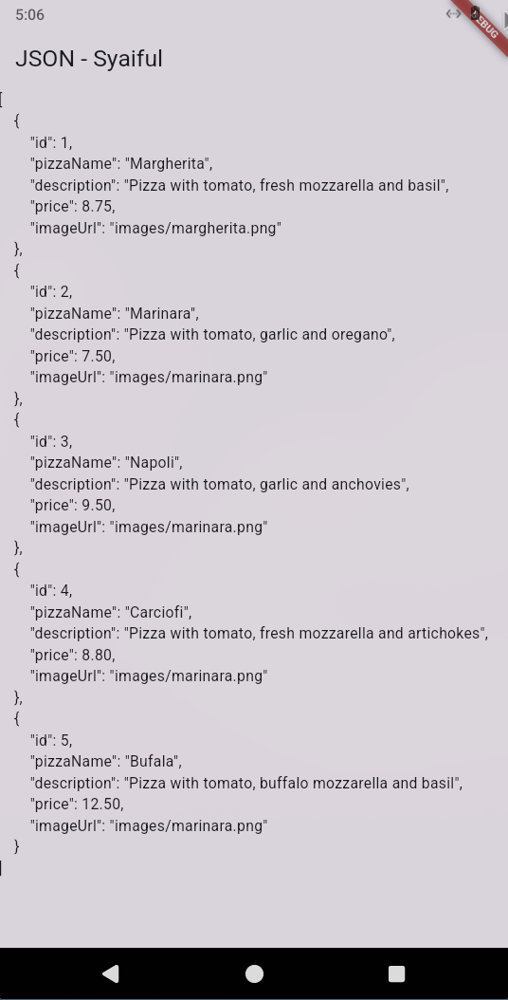
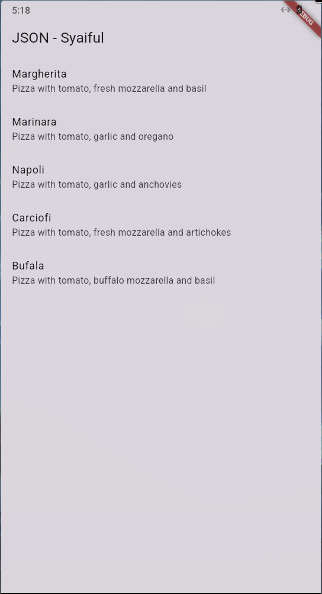
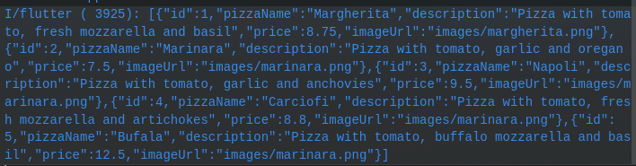
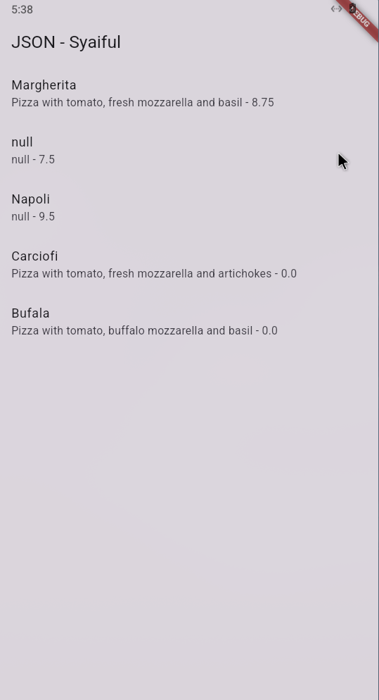
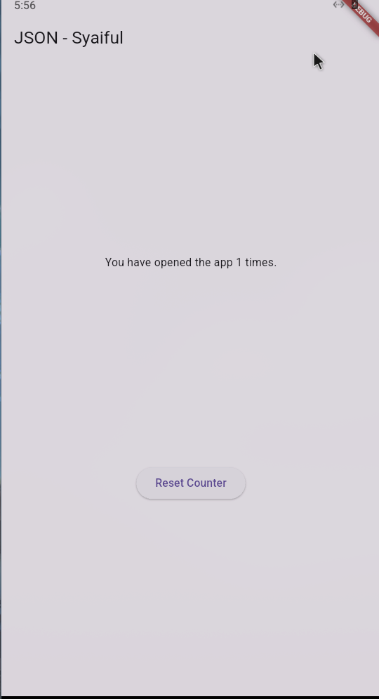
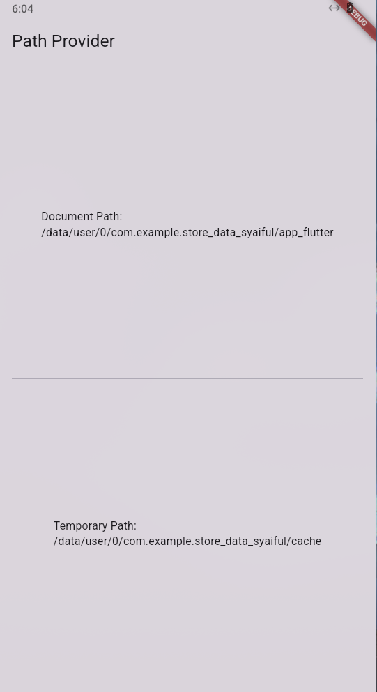
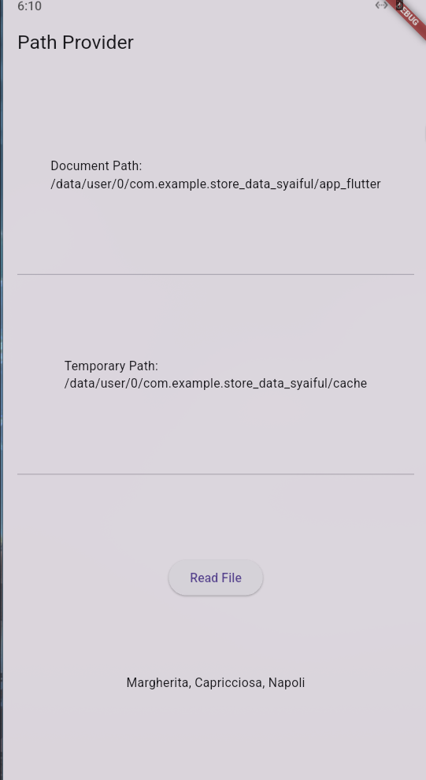

# Praktikum 1: Konversi Dart model ke JSON
### **Langkah 1: Buat Project Baru**

### Langkah 2: Buka file **`main.dart`**
```dart
import 'package:flutter/material.dart';

void main() {
  runApp(const MyApp());
}

class MyApp extends StatelessWidget {
  const MyApp({super.key});

  @override
  Widget build(BuildContext context) {
    return MaterialApp(
      title: 'JSON - Syaiful',
      theme: ThemeData(
        primarySwatch: Colors.blue,
      ),
      home: const MyHomePage(),
    );
  }
}

class MyHomePage extends StatefulWidget {
  const MyHomePage({super.key});

  @override
  State<MyHomePage> createState() => _MyHomePageState();
}

class _MyHomePageState extends State<MyHomePage> {
  @override
  Widget build(BuildContext context) {
    return Scaffold(
      appBar: AppBar(
        title: const Text('JSON - Syaiful'),
      ),
      body: Container(),
    );
  }
}
```
>Soal 1
>
> - Tambahkan nama panggilan Anda pada title app sebagai identitas hasil pekerjaan Anda.
> - Gantilah warna tema aplikasi sesuai kesukaan Anda.
> - Lakukan commit hasil jawaban Soal 1 dengan pesan "W13: Jawaban Soal 1"

### Langkah 3: Buat folder baru **`assets`**

### Langkah 4: Buat file baru **`pizzalist.json`**
```JSON
[
    {
        "id": 1,
        "pizzaName": "Margherita",
        "description": "Pizza with tomato, fresh mozzarella and basil",
        "price": 8.75,
        "imageUrl": "images/margherita.png"
    },
    {
        "id": 2,
        "pizzaName": "Marinara",
        "description": "Pizza with tomato, garlic and oregano",
        "price": 7.50,
        "imageUrl": "images/marinara.png"
    },
    {
        "id": 3,
        "pizzaName": "Napoli",
        "description": "Pizza with tomato, garlic and anchovies",
        "price": 9.50,
        "imageUrl": "images/marinara.png"
    },
    {
        "id": 4,
        "pizzaName": "Carciofi",
        "description": "Pizza with tomato, fresh mozzarella and artichokes",
        "price": 8.80,
        "imageUrl": "images/marinara.png"
    },
    {
        "id": 5,
        "pizzaName": "Bufala",
        "description": "Pizza with tomato, buffalo mozzarella and basil",
        "price": 12.50,
        "imageUrl": "images/marinara.png"
    }
]
```

### Langkah 5: Edit **`pubspec.yaml`**
```yaml
assets:
  - assets/
```

### Langkah 6: Edit **`maint.dart`**
```dart
String pizzaString = '';
```

### Langkah 7: Tetap di **`main.dart`**
```dart
 Future readJsonFile() async {
    String myString = await DefaultAssetBundle.of(
      context,
    ).loadString('assets/pizzalist.json');

    setState(() {
      pizzaString = myString;
    });
  }
```

### **Langkah 8: Panggil method readJsonFile**
```dart
  @override
  void initState() {
    super.initState();
    readJsonFile();
  }
```

### Langkah 9: Tampilkan hasil JSON
```dart
body: Text(pizzaString),
```

### **Langkah** 10: Run
>Soal 2
>
> - Masukkan hasil capture layar ke laporan praktikum Anda.
> - Lakukan commit hasil jawaban Soal 2 dengan pesan "W13: Jawaban Soal 2"



### **Langkah** 11: Buat file baru **`pizza.dart`**

### **Langkah 12: Model pizza.dart**
```dart
class Pizza {
  final int id;
  final String pizzaName;
  final String description;
  final double price;
  final String imageUrl;
}
```

### Langkah 13: Buat `constructor()`
```dart
  factory Pizza.fromJson(Map<String, dynamic> json) {
    return Pizza(
      id: json['id'] ?? 0,
      pizzaName: json['pizzaName'] ?? '',
      description: json['description'] ?? '',
      price: (json['price'] as num?)?.toDouble() ?? 0.0,
      imageUrl: json['imageUrl'] ?? '',
    );
  }
```

### Langkah 14: Pindah ke **`class _MyHomePageState`**
```dart
  Future<List<Pizza>> readJsonFile() async {
    String myString = await DefaultAssetBundle.of(context)
        .loadString('assets/pizzalist.json');
    List pizzaMapList = jsonDecode(myString);
```

### **Langkah 15: Pastikan impor class**
```dart
import 'dart:convert';
import 'package:store_data_syaiful/model/pizza.dart';
```

### Langkah **16: Konversi List Map ke List Objek Dart**
```dart
    List<Pizza> myPizzas = [];
    for (var pizza in pizzaMapList) {
      Pizza myPizza = Pizza.fromJson(pizza);
      myPizzas.add(myPizza);
    }
```

### **Langkah** **17: return myPizzas**
```dart
    return myPizzas;
```

### **Langkah** **18: Perbarui Signature Method**
```dart
Future<List<Pizza>> readJsonFile() async {
```

### **Langkah** **19: Deklarasikan Variabel State**
```dart
List<Pizza> myPizzas = [];
```

### **Langkah** **20: Panggil di initState dan Perbarui State**
```dart
  @override
  void initState() {
    super.initState();
    readJsonFile().then((value) {
      setState(() {
        myPizzas = value;
      });
    });
  }
```

### **Langkah** **21: Tampilkan Data di ListView**
```dart
body: ListView.builder(
  itemCount: myPizzas.length,
  itemBuilder: (context, index) {
    return ListTile(
      title: Text(myPizzas[index].pizzaName),
      subtitle: Text(myPizzas[index].description),
    );
  },
 ));
}
```

### **Langkah** **22: Run**

>Soal 3
>
> - Masukkan hasil capture layar ke laporan praktikum Anda.
> - Lakukan commit hasil jawaban Soal 2 dengan pesan "W13: Jawaban Soal 3"



### **Langkah** **23: Tambahkan Method toJson() (Serialization)**
```dart
  Map<String, dynamic> toJson() {
    return {
      'id': id,
      'pizzaName': pizzaName,
      'description': description,
      'price': price,
      'imageUrl': imageUrl,
    };
  }
```

### **Langkah** **24: Buat Fungsi Konversi JSON String**
```dart
String convertToJSON(List<Pizza> pizzas) {
    return jsonEncode(pizzas.map((pizza) => pizza.toJson()).toList());
}
```

### **Langkah** **25: Tampilkan Output JSON di Konsol**
```dart
String json = convertToJSON(myPizzas);
print(json);
```

### **Langkah** **26: Cek Output Konsol**


# Praktikum 2: Handle kompatibilitas data JSON
### Langkah 1: Simulasikan Error
Anggaplah Anda telah mengganti file `pizzalist.json` dengan data yang tidak konsisten.

### Langkah 2: Lihat Error Tipe Data String ke Int
Jika ID pizza di JSON dikirim sebagai String (misalnya `"id": "1"` di JSON) sementara model Dart mengharapkan int, Anda akan melihat runtime error.

### Langkah 3: Terapkan tryParse dan Null Coalescing pada ID
Di Pizza.fromJson (file pizza.dart), ganti cara mendapatkan nilai id menggunakan int.tryParse dan null coalescing operator (??) untuk memberikan nilai default 0 jika parsing gagal atau nilainya null. Tujuannya adalah memastikan nilai id selalu integer.

### Langkah 4: Simulasikan Error Null pada String
Jika Anda menjalankan ulang dan ada bidang yang hilang (misalnya imageUrl hilang), Anda mungkin mendapatkan error Null.

### Langkah 5: Terapkan Null Coalescing pada String
Tambahkan null coalescing operator (??) pada imageUrl untuk memberikan string kosong ('') jika nilai yang diterima adalah null. Lakukan hal yang sama untuk bidang String lainnya seperti pizzaName dan description jika perlu.

### **Langkah** 6: Gunakan toString() untuk Field String
Untuk memastikan semua nilai yang digunakan sebagai String benar-benar String (bahkan jika mereka mungkin dikirim sebagai int atau tipe lain), gunakan toString().

### **Langkah** **7: Simulasikan Error Tipe Data String ke Double**
Jika Anda menjalankan ulang, Anda mungkin menemukan error saat mengonversi String ke Double untuk bidang price.

### Langkah 8: Terapkan double.tryParse
Terapkan double.tryParse dengan null coalescing (?? 0) untuk bidang price, sama seperti yang Anda lakukan pada id.

### **Langkah 9: Run dan Perhatikan Output Null**



### Langkah 10: Tambahkan Operator Ternary untuk Output User-Friendly
```dart
factory Pizza.fromJson(Map<String, dynamic> json) {
return Pizza(
    id: int.tryParse(json['id'].toString()) ?? 0,
    pizzaName: json['pizzaName'] != null ? json['pizzaName'].toString() : 'No name',
    description: json['description'] != null ? json['description'].toString() : '',
    price: double.tryParse(json['price'].toString()) ?? 0.0,
    imageUrl: json['imageUrl'] != null ? json['imageUrl'].toString() : '',
);
}
```

### Langkah 11: Run
>Soal 4
>
> - Capture hasil running aplikasi Anda, kemudian impor ke laporan praktikum Anda!
> - Lalu lakukan commit dengan pesan "W13: Jawaban Soal 4".


# Praktikum 3: Menangani error JSON
### Langkah 1: Buka `pizza.dart` **dan Buat Konstanta**
```dart
const keyId = 'id';
const keyName = 'pizzaName';
const keyDescription = 'description';
const keyPrice = 'price';
const keyImageUrl = 'imageUrl';
```

### Langkah 2: Perbarui fromJson() menggunakan Konstanta
```dart
id: int.tryParse(json[keyId].toString()) ?? 0,
pizzaName: json[keyName] != null ? json[keyName].toString() : 'No name',
description: json[keyDescription] != null ? json[keyDescription].toString() : '',
price: double.tryParse(json[keyPrice].toString()) ?? 0.0,
imageUrl: json[keyImageUrl] != null ? json[keyImageUrl].toString() : '',
```

### Langkah 3: Perbarui toJson() menggunakan Konstanta
```dart
keyId: id,
keyName: pizzaName,
keyDescription: description,
keyPrice: price,
keyImageUrl: imageUrl,
```
### **Langkah 4: Run**

>Soal 5
>
> - Jelaskan maksud kode lebih safe dan maintainable!
>   - Menghindari kesalahan ketik
> - Capture hasil praktikum Anda dan lampirkan di README.
> - Lalu lakukan commit dengan pesan "W13: Jawaban Soal 5".


# Praktikum 4: SharedPreferences
### Langkah 1: Tambahkan Dependensi
```bash
flutter pub add shared_preferences
```

### Langkah 2: Install Dependensi

### Langkah 3: Lakukan Import
```dart
import 'package:shared_preferences/shared_preferences.dart';
```

### Langkah 4: Tambahkan Variabel appCounter
```dart
int appCounter = 0;
```

### **Langkah 5: Buat Method readAndWritePreference**
```dart
Future<void> readAndWritePreference() async {}
```

### Langkah 6: Dapatkan Instance SharedPreferences
```dart
SharedPreferences prefs = await SharedPreferences.getInstance();
```

### Langkah 7: Baca, Cek Null, dan Increment Counter
```dart
appCounter = prefs.getInt('appCounter') ?? 0;
appCounter++;
```

### Langkah 8: Simpan Nilai Baru
```dart
await prefs.setInt('appCounter', appCounter);
```

### **Langkah 9: Perbarui State**
```dart
setState(() {
    appCounter = appCounter;
});
}
```

### Langkah 10: Panggil di initState()
```dart
  void initState() {
    super.initState();
    readAndWritePreference();
  }
```

### **Langkah 11: Perbarui Tampilan (body)**
```dart
body: Center(
        child: Column(
          mainAxisAlignment: MainAxisAlignment.spaceEvenly,
          children: [
            Text('You have opened the app $appCounter times.'),
            ElevatedButton(
              onPressed: () {},
              child: const Text('Reset Counter'),
            ),
          ],
        ),
      ),
```

### **Langkah 12: Run**


### **Langkah 13: Buat Method deletePreference()**
```dart
Future<void> deletePreference() async {
SharedPreferences prefs = await SharedPreferences.getInstance();
await prefs.clear();
setState(() {
    appCounter = 0;
});
}
```

### **Langkah 14: Panggil deletePreference()**
```dart
onPressed: () {
deletePreference();
},
```

### **Langkah 15: Run**
>Soal 6
>
> - Capture hasil praktikum Anda berupa GIF dan lampirkan di README.
> - Lalu lakukan commit dengan pesan "W13: Jawaban Soal 6".


# Praktikum 5: Akses filesystem dengan path_provider
### Langkah 1: Tambahkan Dependensi
```bash
flutter pub add path_provider
```

### Langkah 2: Lakukan Import
```dart
import 'package:path_provider/path_provider.dart';
```

### **Langkah 3: Tambahkan Variabel Path State**

```dart
String documentPath = '';
String tempPath = '';
```

### Langkah 4: Buat Method getPaths()
```dart
  Future getPaths() async {
    final docDir = await getApplicationDocumentsDirectory();
    final tempDir = await getTemporaryDirectory();
    setState(() {
      documentPath = docDir.path;
      tempPath = tempDir.path;
    });
  }
  ```

### Langkah 5: Panggil getPaths() di initState()
```dart
@override
void initState() {
  super.initState();
  getPaths();
}
```

### **Langkah 6: Perbarui Tampilan**
```dart
Widget build(BuildContext context) {
    return Scaffold(
      appBar: AppBar(title: const Text('Path Provider')),
      body: Padding(
        padding: const EdgeInsets.all(16.0),
        child: Column(
          mainAxisAlignment: MainAxisAlignment.spaceEvenly,
          children: [
            Text(
              'Document Path:\n$documentPath',
            ),
            const Divider(),
            Text(
              'Temporary Path:\n$tempPath',
            ),
          ],
        ),
      ),
    );
  }
  ```

### **Langkah 7: Run**
>Soal 7
>
> - Capture hasil praktikum Anda dan lampirkan di README.
> - Lalu lakukan commit dengan pesan "W13: Jawaban Soal 7".




# Praktikum 6: Akses filesystem dengan direktori
### **Langkah 1: Lakukan Import dart:io**
```dart
import 'dart:io';
```

### Langkah 2: Tambahkan Variabel File dan Text
```dart
late File myFile;
String fileText = '';
```

### Langkah 3: Buat Method writeFile()
```dart
Future<bool> writeFile() async {
  try {
    await myFile.writeAsString('Margherita, Capricciosa, Napoli');
    return true;
  } catch (e) {
    return false;
  }
}
```

### **Langkah 4: Inisialisasi File dan Panggil writeFile() di initState()**
```dart
  @override
  void initState() {
    super.initState();
    readAndWritePreference();
    getPaths().then((_) {
      myFile = File('$documentPath/pizzas.txt');
      writeFile();
    });
  }
  ```

### Langkah 5: Buat Method readFile()
```dart
  Future<bool> readFile() async {
    try {
      String fileContent = await myFile.readAsString();
      setState(() {
        fileText = fileContent;
      });
      return true;
    } catch (e) {
      return false;
    }
  }
  ```

### Langkah 6: Edit build() dan Tambahkan Tombol Baca
```dart
children: [
Text(
    'Document Path:\n$documentPath'
),
const Divider(),
Text(
    'Temporary Path:\n$tempPath',
),
const Divider(),
ElevatedButton(
    onPressed: () => readFile(),
    child: const Text('Read File'),
),
Text(
    fileText,
),
],
```

### Langkah 7: Run
>Soal 8
>
> - Jelaskan maksud kode pada langkah 3 dan 7 !
>   - `writeFile()` berfungsi untuk menyimpan teks "Margherita, Capricciosa, Napoli".
>   - Memanggil fungsi `readFile()` untuk membaca data 
> - Capture hasil praktikum Anda berupa GIF dan lampirkan di README.
> - Lalu lakukan commit dengan pesan "W13: Jawaban Soal 8".




# Praktikum 7: Menyimpan data dengan enkripsi/dekripsi
### Langkah 1: Tambahkan Dependensi
```bash
flutter pub add flutter_secure_storage
```

### Langkah 2: Lakukan Import
```dart
import 'package:flutter_secure_storage/flutter_secure_storage.dart';
```

### Langkah 3: Tambahkan Variabel dan Controller
```dart
final pwdController = TextEditingController();
String myPass = '';
```

### Langkah 4: Inisialisasi Secure Storage
```dart
final storage = const FlutterSecureStorage();
final String myKey = "myPass";
```

### **Langkah 5: Buat Method writeToSecureStorage()**
```dart
Future<void> writeToSecureStorage() async {
await storage.write(key: myKey, value: pwdController.text);
}
```

### Langkah 6: Buat Method readFromSecureStorage()
```dart
  Future<String> readFromSecureStorage() async {
    return await storage.read(key: myKey) ?? "";
  }
```

### Langkah 7: Edit build() untuk UI dan Logic
```dart
// Di dalam body: Column children:
TextField(
  controller: pwdController,
),
ElevatedButton(child: const Text('Save Value'), onPressed: () {
  writeToSecureStorage();
}),
// ...
```

### Langkah 8: Hubungkan Read ke Tombol
```dart
ElevatedButton(
    child: const Text('Read Value'),
    onPressed: () async {
    String value = await readFromSecureStorage();
    setState(() {
        myPass = value;
    });
    },
),
Text(myPass),
```

### Langkah 9: Run

> Soal 9
>
> - Capture hasil praktikum Anda berupa GIF dan lampirkan di README.
> - Lalu lakukan commit dengan pesan "W13: Jawaban Soal 9".


