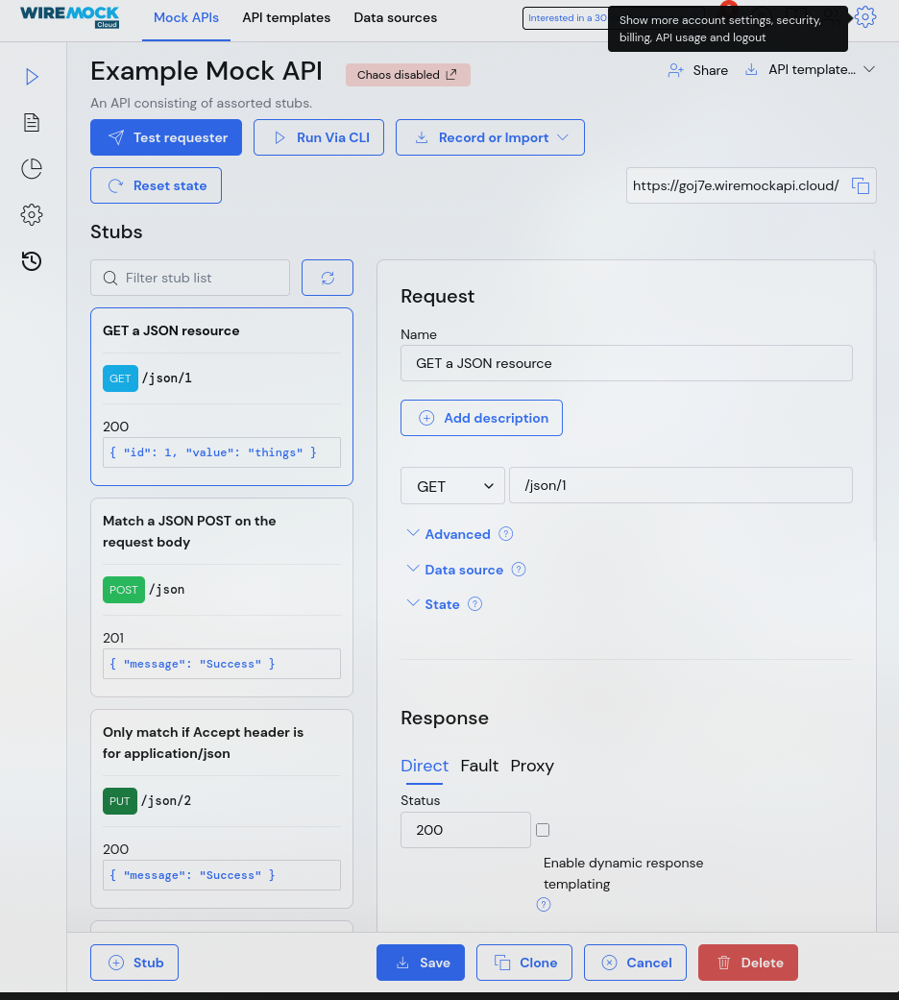
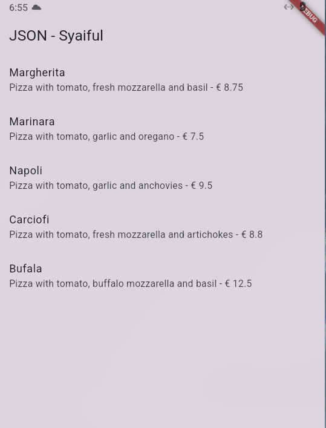
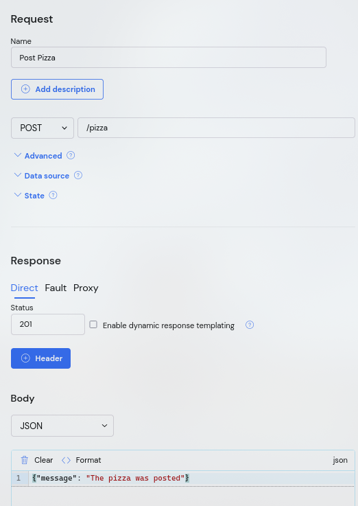
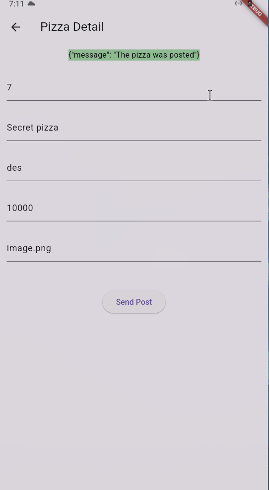
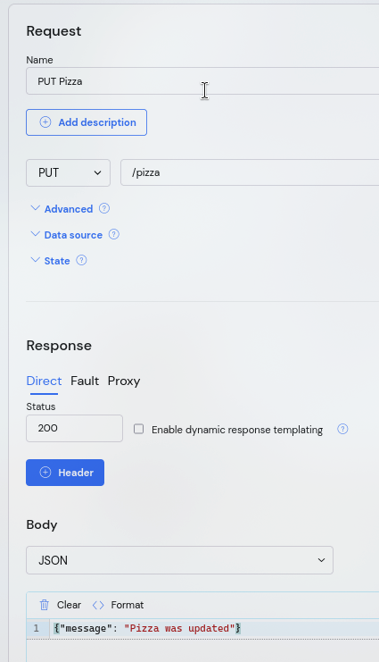
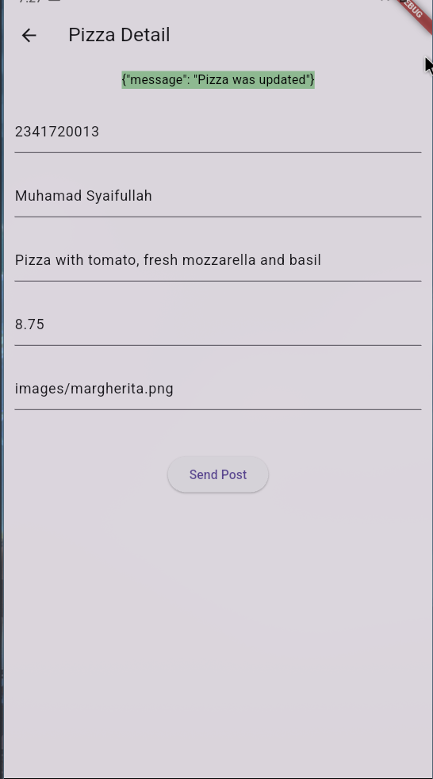
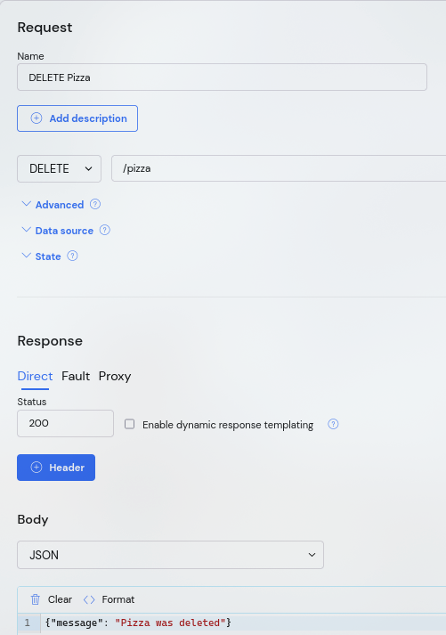
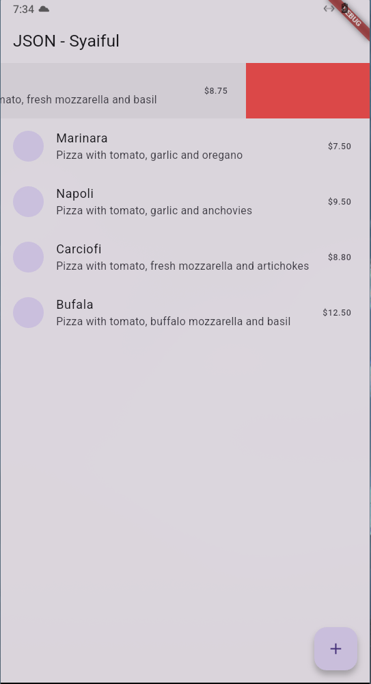
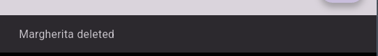

# Praktikum 1: Membuat layanan Mock API
### Exanmple Mock API


### Tambah dependensi
```bash
flutter pub add http
```

### Membuat `httphelper.dart`
```dart
import 'dart:io'; 
import 'package:http/http.dart' as http; 
import 'dart:convert'; 
import 'model/pizza.dart'; 

class HttpHelper {
  final String authority = '02z2g.mocklab.io';
  final String path = 'pizzalist';
  Future<List<Pizza>> getPizzaList() async {
    final Uri url = Uri.https(authority, path);
    final http.Response result = await http.get(url);
    if (result.statusCode == HttpStatus.ok) {
      final jsonResponse = json.decode(result.body);
      //provide a type argument to the map method to avoid type 
      //error
      List<Pizza> pizzas =
          jsonResponse.map<Pizza>((i) => 
            Pizza.fromJson(i)).toList();
      return pizzas;
    } else {
      return [];
    }
  }
}
```

### Di file main.dart, di kelas _MyHomePageState, tambahkan metode bernama callPizzas. Ini mengembalikan Future dari List objek Pizza dengan memanggil metode getPizzaList dari kelas HttpHelper, sebagai berikut:

```dart
  Future<List<Pizza>> callPizzas() async {
    HttpHelper helper = HttpHelper();
    List<Pizza> pizzas = await helper.getPizzaList();
    return pizzas;
  }
  ```

### Di metode build dari kelas _MyHomePageState, di body Scaffold, tambahkan FutureBuilder yang membangun ListView dari widget ListTile yang berisi objek Pizza:
```dart
@override
  Widget build(BuildContext context) {
    return Scaffold(
      appBar: AppBar(title: const Text('JSON - Syaiful')),
      body: FutureBuilder(
        future: callPizzas(),
        builder: (BuildContext context, AsyncSnapshot<List<Pizza>> snapshot) {
          if (snapshot.hasError) {
            return const Text('Something went wrong');
          }
          if (!snapshot.hasData) {
            return const CircularProgressIndicator();
          }
          return ListView.builder(
            itemCount: (snapshot.data == null) ? 0 : snapshot.data!.length,
            itemBuilder: (BuildContext context, int position) {
              return ListTile(
                title: Text(snapshot.data![position].pizzaName),
                subtitle: Text(
                  snapshot.data![position].description +
                      ' - € ' +
                      snapshot.data![position].price.toString(),
                ),
              );
            },
          );
        },
      ),
    );
  }
```

### run
> Soal 1
>
> - Tambahkan nama panggilan Anda pada title app sebagai identitas hasil pekerjaan Anda.
> - Gantilah warna tema aplikasi sesuai kesukaan Anda.
> - Capture hasil aplikasi Anda, lalu masukkan ke laporan di README dan lakukan commit hasil jawaban Soal 1 dengan pesan "W14: Jawaban Soal 1"



# Praktikum 2: Mengirim Data ke Web Service (POST)
### Buat Mock Pizza


### Membuat method post pada `httphelper.dart`
```dart
  Future<String> postPizza(Pizza pizza) async {
    const postPath = '/pizza';
    String post = json.encode(pizza.toJson());
    Uri url = Uri.https(authority, postPath);
    http.Response r = await http.post(url, body: post);
    return r.body;
  }
```

### Di proyek, buat file baru bernama `pizza_detail.dart`

### import
```dart
import 'package:flutter/material.dart';
import 'pizza.dart';
import 'httphelper.dart';
```

### Buat StatefulWidget bernama PizzaDetailScreen:
```dart
class PizzaDetailScreen extends StatefulWidget {
  const PizzaDetailScreen({super.key});
  @override
  State<PizzaDetailScreen> createState() => _PizzaDetailScreenState();
}

class _PizzaDetailScreenState extends State<PizzaDetailScreen> {
  @override
  Widget build(BuildContext context) {
    return Placeholder();
  }
}
```
### Di bagian atas kelas _PizzaDetailScreenState, tambahkan lima TextEditingController. Ini akan berisi data untuk objek Pizza yang akan diposting nanti. Juga, tambahkan String yang akan berisi hasil dari permintaan POST:

```dart
final TextEditingController txtId = TextEditingController();
final TextEditingController txtName = TextEditingController();
final TextEditingController txtDescription = TextEditingController();
final TextEditingController txtPrice = TextEditingController();
final TextEditingController txtImageUrl = TextEditingController();
String operationResult = '';
```

### Override metode dispose() untuk membuang controller:
```dart
@override
void dispose() {
  txtId.dispose();
  txtName.dispose();
  txtDescription.dispose();
  txtPrice.dispose();
  txtImageUrl.dispose();
  super.dispose();
}
```

### Di metode build() dari kelas, kembalikan Scaffold, yang AppBar-nya berisi Text "Pizza Detail" dan body-nya berisi Padding dan SingleChildScrollView yang berisi Column:
```dart
  @override
  Widget build(BuildContext context) {
    return Scaffold(
      appBar: AppBar(title: const Text('Pizza Detail')),
      body: Padding(
        padding: const EdgeInsets.all(12),
        child: SingleChildScrollView(child: Column(children: [])),
      ),
    );
  }
```

### Untuk properti children dari Column, tambahkan beberapa Text yang akan berisi hasil dari post, lima TextField, masing-masing terikat ke TextEditingController mereka sendiri, dan ElevatedButton untuk menyelesaikan aksi POST (metode postPizza akan dibuat selanjutnya). Juga, tambahkan SizedBox untuk menjauhkan widget di layar:
```dart
children: [
    Text(
    operationResult,
    style: TextStyle(
        backgroundColor: Colors.green[200],
        color: Colors.black,
    ),
    ),
    const SizedBox(height: 24),
    TextField(
    controller: txtId,
    decoration: const InputDecoration(hintText: 'Insert ID'),
    ),
    const SizedBox(height: 24),
    TextField(
    controller: txtName,
    decoration: const InputDecoration(
        hintText: 'Insert Pizza Name',
    ),
    ),
    const SizedBox(height: 24),
    TextField(
    controller: txtDescription,
    decoration: const InputDecoration(
        hintText: 'Insert Description',
    ),
    ),
    const SizedBox(height: 24),
    TextField(
    controller: txtPrice,
    decoration: const InputDecoration(hintText: 'Insert Price'),
    ),
    const SizedBox(height: 24),
    TextField(
    controller: txtImageUrl,
    decoration: const InputDecoration(hintText: 'Insert Image Url'),
    ),
    const SizedBox(height: 48),
    ElevatedButton(
    child: const Text('Send Post'),
    onPressed: () {
        postPizza();
    },
    ),
],
```

### Di bagian bawah kelas _PizzaDetailScreenState, tambahkan metode postPizza:
```dart
  Future postPizza() async {
    HttpHelper helper = HttpHelper();
    Pizza pizza = Pizza(
      id: int.tryParse(txtId.text) ?? 0,
      pizzaName: txtName.text,
      description: txtDescription.text,
      price: double.tryParse(txtPrice.text) ?? 0.0,
      imageUrl: txtImageUrl.text,
    );
    String result = await helper.postPizza(pizza);
    setState(() {
      operationResult = result;
    });
  }
```

### Di file main.dart, impor file pizza_detail.dart Di Scaffold dari metode build() kelas _MyHomePageState, tambahkan FloatingActionButton yang akan navigasi ke rute PizzaDetail:
```dart
floatingActionButton: FloatingActionButton(
child: const Icon(Icons.add),
onPressed: () {
    Navigator.push(
    context,
    MaterialPageRoute(builder: (context) => const PizzaDetailScreen()),
    );
},
),
```

### Run




# Praktikum 3: Memperbarui Data di Web Service (PUT)

### Membuat Mock PUT


### Membuat method PUT
```dart
 Future<String> putPizza(Pizza pizza) async {
    const putPath = '/pizza';
    String put = json.encode(pizza.toJson());
    Uri url = Uri.https(authority, putPath);
    http.Response r = await http.put(url, body: put);
    return r.body;
  }
```

### Di kelas PizzaDetailScreen di file pizza_detail.dart, tambahkan dua properti, sebuah Pizza dan sebuah boolean, dan di konstruktor, atur kedua properti tersebut:
```dart
final Pizza pizza;
  final bool isNew;
  const PizzaDetailScreen({
    super.key,
    required this.pizza,
    required this.isNew,
  });
```

### Di kelas PizzaDetailScreenState, override metode initState. Ketika properti isNew dari kelas PizzaDetail bukan baru, itu mengatur konten TextField dengan nilai-nilai objek Pizza yang diteruskan:
```dart
@override
  void initState() {
    if (!widget.isNew) {
      txtId.text = widget.pizza.id.toString();
      txtName.text = widget.pizza.pizzaName;
      txtDescription.text = widget.pizza.description;
      txtPrice.text = widget.pizza.price.toString();
      txtImageUrl.text = widget.pizza.imageUrl;
    }
    super.initState();
  }
```

### Edit metode savePizza sehingga memanggil metode helper.postPizza ketika isNew benar, dan helper.putPizza ketika salah:
```dart
final result = await (widget.isNew
    ? helper.postPizza(pizza)
    : helper.putPizza(pizza));
setState(() {
    operationResult = result;
});
```

### Di file main.dart, di metode build dari _MyHomePageState, tambahkan properti onTap ke ListTile sehingga ketika pengguna mengetuknya, aplikasi akan mengubah rute dan menampilkan layar PizzaDetail, meneruskan pizza saat ini dan false untuk parameter isNew:

```dart
return ListTile(
    title: Text(pizzas.data![position].pizzaName),
    subtitle: Text(pizzas.data![position].description +
                  ' - € ' +
                  pizzas.data![position].price.toString()),
    onTap: () {
       Navigator.push(
          context,
          MaterialPageRoute(
             builder: (context) => PizzaDetailScreen(
                pizza: pizzas.data![position], isNew: false)),
    );
```

### Di floatingActionButton, teruskan Pizza baru dan true untuk parameter isNew ke rute PizzaDetail:
```dart
floatingActionButton: FloatingActionButton(
          child: Icon(Icons.add),
          onPressed: () {
            Navigator.push(
              context,
              MaterialPageRoute(
                  builder: (context) => PizzaDetailScreen(
                        pizza: Pizza(),
                        isNew: true,
                      )),            
           );
      }),
);
```

### Run
>Soal 3
>
> - Ubah salah satu data dengan Nama dan NIM Anda, lalu perhatikan hasilnya di Wiremock.
> - Capture hasil aplikasi Anda berupa GIF di README dan lakukan commit hasil jawaban Soal 3 dengan pesan "W14: Jawaban Soal 3"



# Praktikum 4: Menghapus Data dari Web Service (DELETE)
### Membuat Mock DELETE


### Membuat method delete
```dart
Future<String> deletePizza(int id) async {
  const deletePath = '/pizza';
  Uri url = Uri.https(authority, deletePath);
  http.Response r = await http.delete(
    url,
  );
  return r.body;
}
```

### Di file main.dart, di metode build dari kelas _MyHomePageState, refactor itemBuilder dari ListView.builder sehingga ListTile terkandung dalam widget Dismissible, sebagai berikut:
```dart
return ListView.builder(
    itemCount: (pizzas.data == null) ? 0 : pizzas.data.length,
    itemBuilder: (BuildContext context, int position) {
        return Dismissible(
                    key: Key(position.toString()),
                    onDismissed: (item) {
                      HttpHelper helper = HttpHelper();
                      pizzas.data!.removeWhere(
                          (element) => element.id == pizzas.data![position].id);
                      helper.deletePizza(pizzas.data![position].id!);
                    },
                    child: ListTile(...
```

### Run
>Soal 4
>
> - Capture hasil aplikasi Anda berupa GIF di README dan lakukan commit hasil jawaban Soal 4 dengan pesan "W14: Jawaban Soal 4"





