## Praktikum 1: Membuat Project Flutter Baru
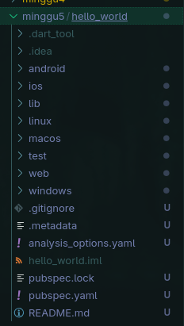

## Praktikum 2: Menghubungkan Perangkat Android atau Emulator
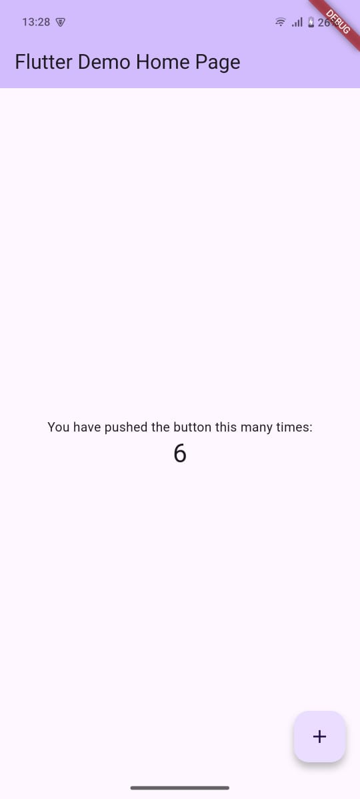

## Praktikum 3: Membuat Repository GitHub dan Laporan Praktikum
Melakukan push projek ke github
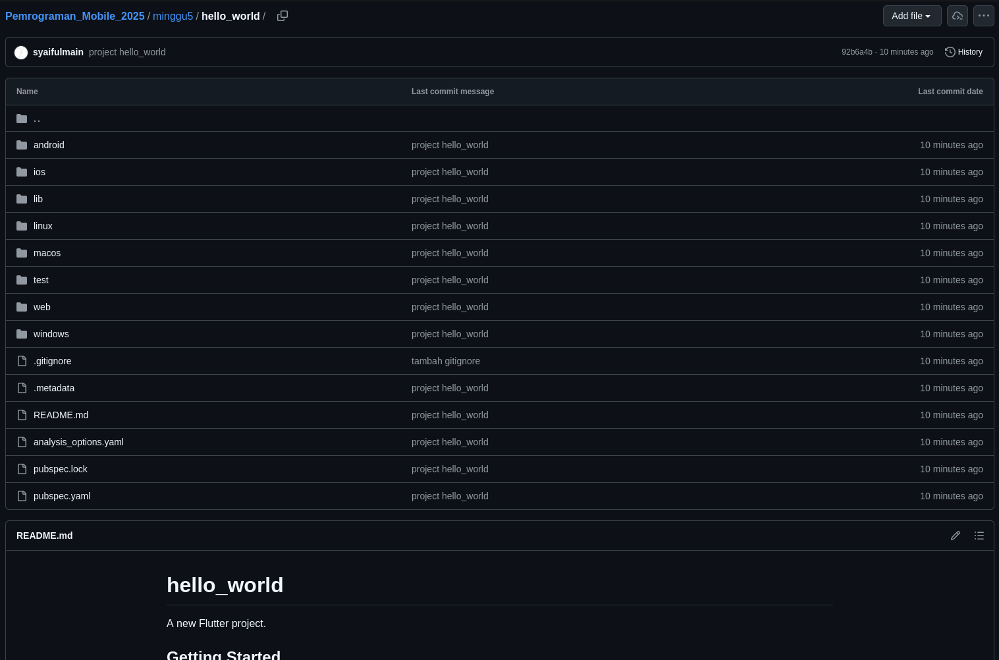
Menjalankan projek
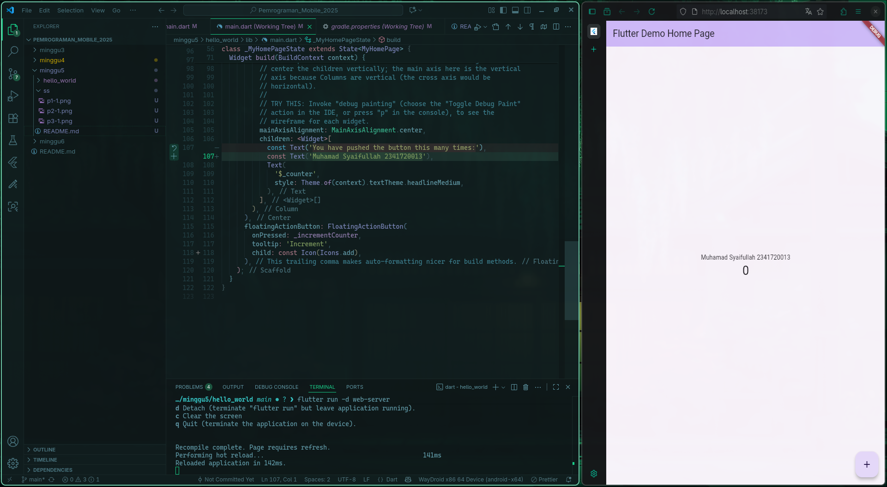

## Praktikum 4: Menerapkan Widget Dasar
### Text Widget
Membuat Text Widget
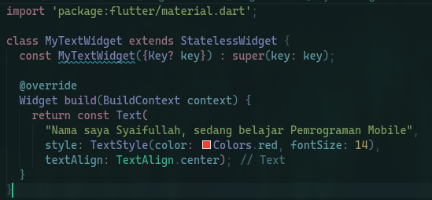
Memanggil fungsi MyTextWidget()
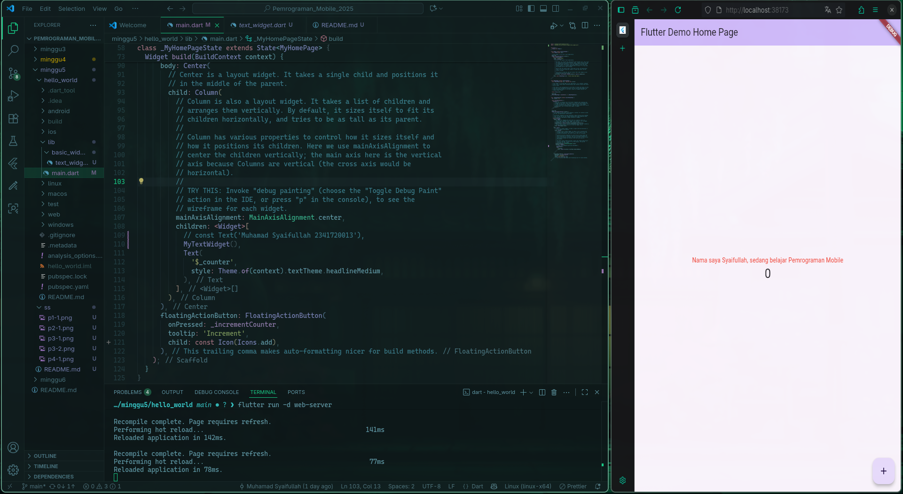

### Image Widget
Membuat Image Widget
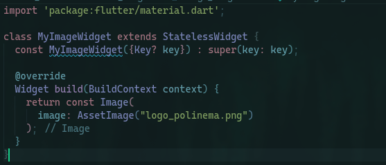
Memanggil funsi MyImageWidget
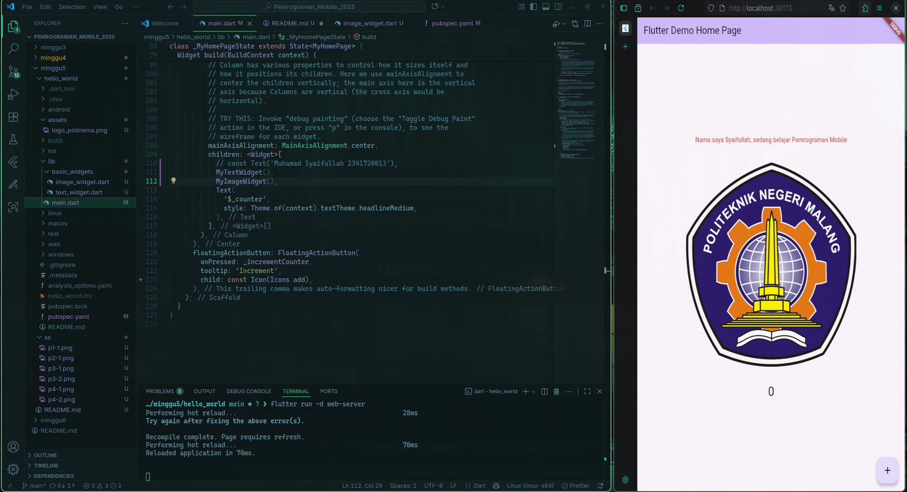

## Praktikum 5: Menerapkan Widget Material Design dan iOS Cupertino
### Cupertino Button dan Loading Bar
Membuat tombol dan loading bar
Membuat widget
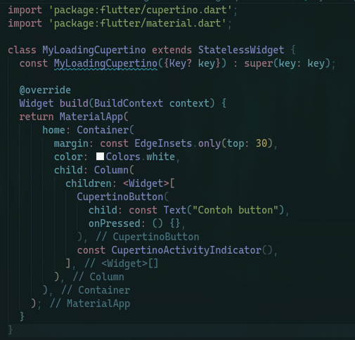
Implementasi
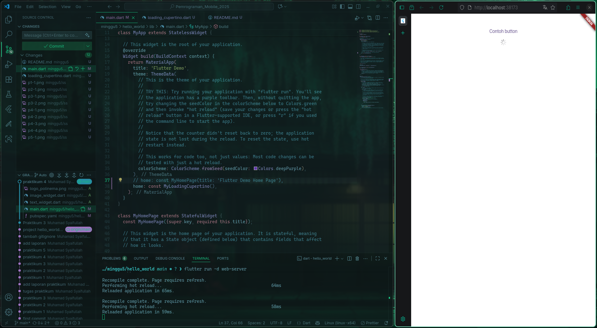

### Floating Action Button (FAB)
Membuat floating button dengan aksi
Membuat widget
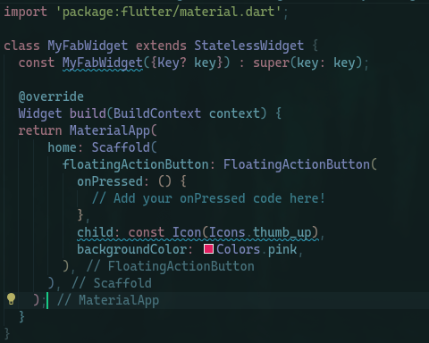
Implementasi
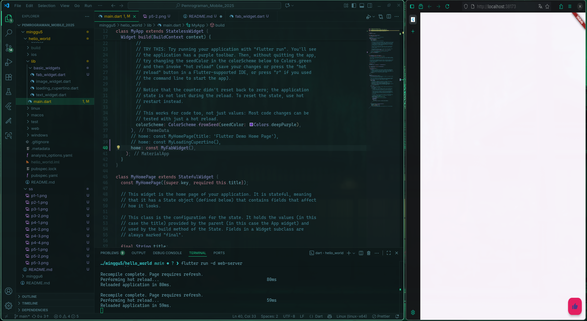

### Scaffold Widget
Scaffold widget digunakan untuk mengatur tata letak sesuai dengan material design.
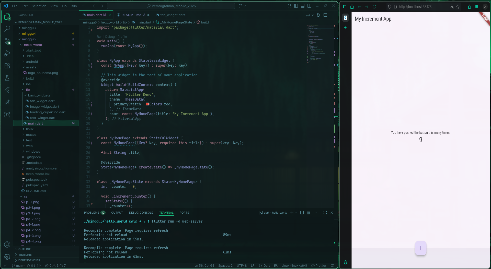

### Dialog Widget
Membuat dan menampilkan alert
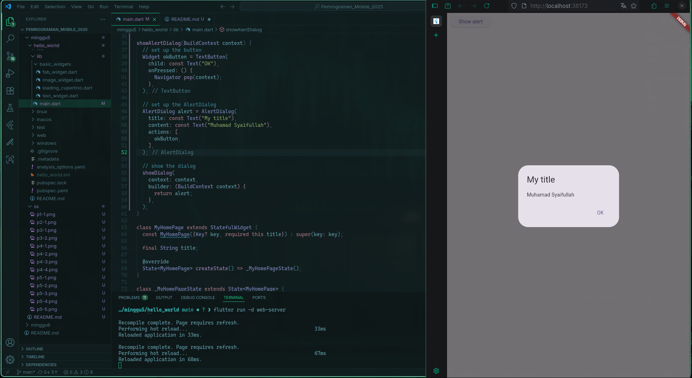

### Input dan Selection Widget
Membuat input field pengguna
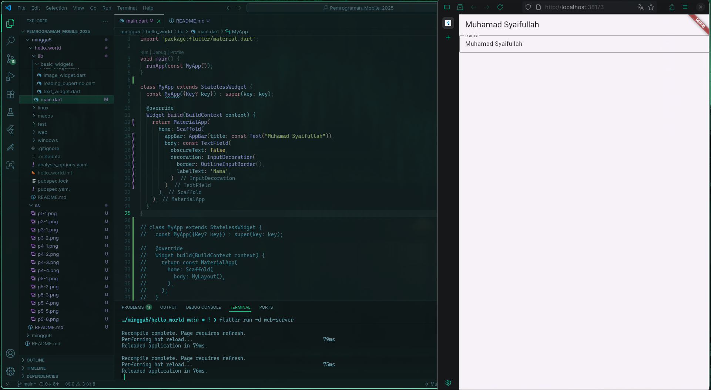

### Date and Time Pickers
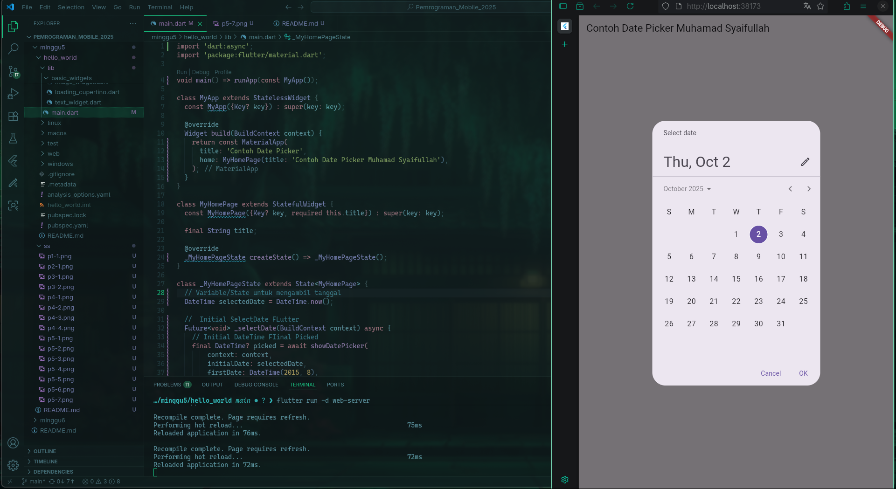

##
