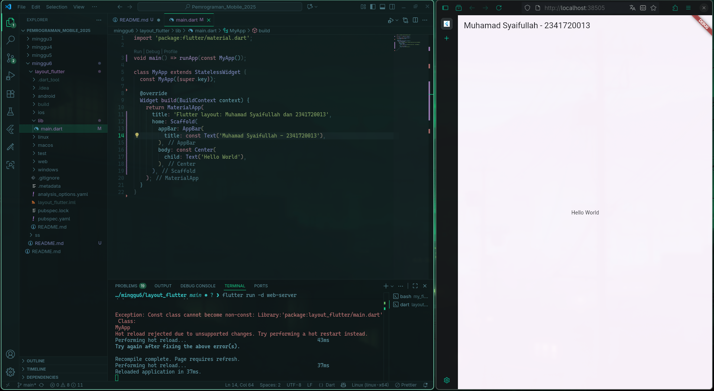
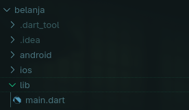

# Tugas Praktikum 1

## 1.Selesaikan Praktikum 1 sampai 4, lalu dokumentasikan dan push ke repository Anda berupa screenshot setiap hasil pekerjaan beserta penjelasannya di file `README.md`!

### Praktikum 1: Membangun Layout di Flutter

#### Langkah 1: Buat Project Baru

Buatlah sebuah project flutter baru dengan nama layout_flutter. Atau sesuaikan style laporan praktikum yang Anda buat.

#### Langkah 2: Buka file lib/main.dart

Buka file `main.dart` lalu ganti dengan kode berikut. Isi nama dan NIM Anda di `text title`.



#### Langkah 3: Identifikasi layout diagram

Langkah pertama adalah memecah tata letak menjadi elemen dasarnya:

- Identifikasi baris dan kolom.

- Apakah tata letaknya menyertakan kisi-kisi (grid)?

  Kolom utama (Column):

  - Hero
  - Title section (Row):
    - Column:
      - Title
      - Subtitle
    - Spacer
    - Row:
      - Ikon bintang
      - Jumlah bintang
  - Button section (Row)
    - Column:
      - Icon
      - Text
    - Column:
      - Icon
      - Text
    - Column:
      - Icon
      - Text
  - Blok Text

- Apakah ada elemen yang tumpang tindih?
  Tidak
- Apakah UI memerlukan tab?
  Tidak
- Perhatikan area yang memerlukan alignment, padding, atau borders.
  - Title section dan button section memerlukan alignment dan padding

#### Langkah 4: Implementasi title row

Pertama, Anda akan membuat kolom bagian kiri pada judul. Tambahkan kode berikut di bagian atas metode `build()` di dalam kelas `MyApp`:

```dart
Widget build(BuildContext context) {
    Widget titleSection = Container(
      padding: const EdgeInsets.all(32.0),
      child: Row(
        children: [
          Expanded(
            /* soal 1*/
            child: Column(
              crossAxisAlignment: CrossAxisAlignment.start,
              children: [
                /* soal 2*/
                Container(
                  padding: const EdgeInsets.only(bottom: 8.0),
                  child: const Text(
                    'Wisata Gunung di Batu',
                    style: TextStyle(fontWeight: FontWeight.bold),
                  ),
                ),
                Text(
                  'Batu, Malang, Indonesia',
                  style: TextStyle(color: Colors.grey[500]),
                ),
              ],
            ),
          ),
          /* soal 3*/
          Icon(Icons.star, color: Colors.red[500]),
          const Text("41"),
        ],
      ),
    );
```


### Praktikum 2: Implementasi button row

#### Langkah 1: Buat method Column \_buildButtonColumn

```dart
Column _buildButtonColumn(Color color, IconData icon, String label) {
    return Column(
      mainAxisSize: MainAxisSize.min,
      mainAxisAlignment: MainAxisAlignment.center,
      children: [
        Icon(icon, color: color),
        Container(
          margin: const EdgeInsets.only(top: 8),
          child: Text(
            label,
            style: TextStyle(
              fontSize: 12,
              fontWeight: FontWeight.w400,
              color: color,
            ),
          ),
        ),
      ],
    );
  }
```

#### Langkah 2: Buat widget buttonSection

```dart
Color color = Theme.of(context).primaryColor;

Widget buttonSection = Row(
  mainAxisAlignment: MainAxisAlignment.spaceEvenly,
  children: [
    _buildButtonColumn(color, Icons.call, 'CALL'),
    _buildButtonColumn(color, Icons.near_me, 'ROUTE'),
    _buildButtonColumn(color, Icons.share, 'SHARE'),
  ],
);
```

#### Langkah 3: Tambah button section ke body

```dart
    return MaterialApp(
      title: 'Flutter layout: Muhamad Syaifullah dan 2341720013',
      home: Scaffold(
        appBar: AppBar(title: const Text('Muhamad Syaifullah - 2341720013')),
        body: Column(children: [titleSection, buttonSection]),
      ),
    );
```


### Praktikum 3: Implementasi text section

#### Langkah 1: Buat widget textSection

```dart
Widget textSection = Container(
  padding: const EdgeInsets.all(32),
  child: const Text(
    'Kota Batu, yang terletak di Jawa Timur, dikenal sebagai kota wisata pegunungan dengan udara sejuk dan panorama alam yang indah. Dikelilingi oleh deretan gunung, kawasan ini menjadi destinasi favorit bagi wisatawan yang menyukai petualangan alam, pendakian, dan panorama pegunungan. Beberapa gunung di Batu juga memiliki nilai sejarah, keunikan geologi, serta daya tarik wisata yang memikat.'
    '\nMuhamad Syaifullah 2341720013',
    softWrap: true,
  ),
);
```

#### Langkah 2: Tambahkan variabel text section ke body

```dart
    return MaterialApp(
      title: 'Flutter layout: Muhamad Syaifullah dan 2341720013',
      home: Scaffold(
        appBar: AppBar(title: const Text('Muhamad Syaifullah - 2341720013')),
        body: Column(children: [titleSection, buttonSection, textSection]),
      ),
    );
```


### Praktikum 4: Implementasi image section

#### Langkah 1: Siapkan aset gambar

```yaml
assets:
  - images/mountain.png
```


#### Langkah 2: Tambahkan gambar ke body

```dart
    return MaterialApp(
      title: 'Flutter layout: Muhamad Syaifullah dan 2341720013',
      home: Scaffold(
        appBar: AppBar(title: const Text('Muhamad Syaifullah - 2341720013')),
        body: Column(
          children: [
            Image.asset(
              'images/mountain.png',
              width: 600,
              height: 240,
              fit: BoxFit.cover,
            ),
            titleSection,
            buttonSection,
            textSection,
          ],
        ),
      ),
    );
```

#### Langkah 3: Terakhir, ubah menjadi ListView

```dart
    return MaterialApp(
      title: 'Flutter layout: Muhamad Syaifullah dan 2341720013',
      home: Scaffold(
        appBar: AppBar(title: const Text('Muhamad Syaifullah - 2341720013')),
        body: ListView(
          children: [
            Image.asset(
              'images/mountain.png',
              width: 600,
              height: 240,
              fit: BoxFit.cover,
            ),
            titleSection,
            buttonSection,
            textSection,
          ],
        ),
      ),
    );
```


## 2. Silakan implementasikan di project baru "basic_layout_flutter" dengan mengakses sumber ini: https://docs.flutter.dev/codelabs/layout-basics


## 3. Kumpulkan link commit repository GitHub Anda kepada dosen yang telah disepakati!

### Praktikum 5: Membangun Navigasi di Flutter

#### Langkah 1: Siapkan project baru



#### Langkah 2: Mendefinisikan Route

`pages/home_page.dart`

```dart
import 'package:flutter/material.dart';

class HomePage extends StatelessWidget {
  @override
  Widget build(BuildContext context) {
    throw UnimplementedError();
  }
}
```

`pages/item_page.dart`

```dart
import 'package:flutter/material.dart';

class ItemPage extends StatelessWidget {
  @override
  Widget build(BuildContext context) {
    throw UnimplementedError();
  }
}
```

#### Langkah 3: Lengkapi Kode di `main.dart`

```dart
import 'package:belanja/pages/home_page.dart';
import 'package:belanja/pages/item_page.dart';
import 'package:flutter/material.dart';

void main() {
  runApp(
    MaterialApp(
      initialRoute: '/',
      routes: {
        '/': (context) => const HomePage(),
        '/item': (context) => const ItemPage(),
      },
    ),
  );
}
```

#### Langkah 4: Membuat data model

`models/item.dart`

```dart
class Item {
  String name;
  int price;

  Item({required this.name, required this.price});
}
```

#### Langkah 5: Lengkapi kode di class HomePage

```dart
class HomePage extends StatelessWidget {
  final List<Item> items = [
    Item(name: 'Sugar', price: 5000),
    Item(name: 'Salt', price: 2000),
  ];
  ...
}
```

#### Langkah 6: Membuat ListView dan itemBuilder

```dart
return Scaffold(
      body: Container(
        margin: EdgeInsets.all(8),
        child: ListView.builder(
          padding: EdgeInsets.all(8),
          itemCount: items.length,
          itemBuilder: (context, index) {
            final item = items[index];
            return Card(
              child: Container(
                margin: EdgeInsets.all(8),
                child: Row(
                  children: [
                    Expanded(child: Text(item.name)),
                    Expanded(
                      child: Text(
                        item.price.toString(),
                        textAlign: TextAlign.end,
                      ),
                    ),
                  ],
                ),
              ),
            );
          },
        ),
      ),
    );
```

#### Langkah 7: Menambahkan aksi pada ListView

```dart
return Scaffold(
      body: Container(
        margin: EdgeInsets.all(8),
        child: ListView.builder(
          padding: EdgeInsets.all(8),
          itemCount: items.length,
          itemBuilder: (context, index) {
            final item = items[index];
            return InkWell(
              onTap: () {
                Navigator.pushNamed(context, '/item');
              },
              child: Card(
                child: Container(
                  margin: EdgeInsets.all(8),
                  child: Row(
                    children: [
                      Expanded(child: Text(item.name)),
                      Expanded(
                        child: Text(
                          item.price.toString(),
                          textAlign: TextAlign.end,
                        ),
                      ),
                    ],
                  ),
                ),
              ),
            );
          },
        ),
      ),
    );
```


# Tugas Praktikum 2

## 1. Untuk melakukan pengiriman data ke halaman berikutnya, cukup menambahkan informasi arguments pada penggunaan `Navigator`.Perbarui kode pada bagian `Navigator` menjadi seperti berikut.

```dart
return InkWell(
              onTap: () => {
                Navigator.pushNamed(context, '/item', arguments: item),
              },
```

## 2. Pembacaan nilai yang dikirimkan pada halaman sebelumnya dapat dilakukan menggunakan `ModalRoute`. Tambahkan kode berikut pada blok fungsi build dalam halaman `ItemPage`. Setelah nilai didapatkan, anda dapat menggunakannya seperti penggunaan variabel pada umumnya. (https://docs.flutter.dev/cookbook/navigation/navigate-with-arguments)

```dart
import 'package:belanja/models/item.dart';
import 'package:flutter/material.dart';

class ItemPage extends StatelessWidget {
  @override
  Widget build(BuildContext context) {
    final itemArgs = ModalRoute.of(context)!.settings.arguments as Item;
    return Scaffold(
      appBar: AppBar(title: Text(itemArgs.name)),
      body: Container(
        margin: EdgeInsets.all(8),
        child: Column(
          crossAxisAlignment: CrossAxisAlignment.start,
          children: [
            Text('Name: ${itemArgs.name}'),
            Text('Price: ${itemArgs.price}'),
          ],
        ),
      ),
    );
  }
}


```

## 3. Pada hasil akhir dari aplikasi belanja yang telah anda selesaikan, tambahkan atribut foto produk, stok, dan rating. Ubahlah tampilan menjadi `GridView` seperti di aplikasi marketplace pada umumnya.


## 4. Silakan implementasikan `Hero widget` pada aplikasi belanja Anda dengan mempelajari dari sumber ini: https://docs.flutter.dev/cookbook/navigation/hero-animations

`pages/home_page.dart`

```dart
child: Hero(
                          tag: item.images,
                          child: Image.asset(
                            item.images,
                            width: double.infinity,
                            fit: BoxFit.cover,
                          ),
                        ),
```

`pages/item_page.dart`

```dart
child: Hero(
                tag: itemArgs.images,
                child: Image.asset(
                  itemArgs.images,
                  width: double.infinity,
                  fit: BoxFit.cover,
                  height: imageHeight,
                ),
              ),
```


## 5. Sesuaikan dan modifikasi tampilan sehingga menjadi aplikasi yang menarik. Selain itu, pecah widget menjadi kode yang lebih kecil. Tambahkan Nama dan NIM di footer aplikasi belanja Anda.

```dart
bottomNavigationBar: Container(
        color: Theme.of(context).primaryColor,
        padding: const EdgeInsets.symmetric(vertical: 12),
        child: const Text(
          'Belanja App Muhamad Syaifullah 2341720013',
          textAlign: TextAlign.center,
          style: TextStyle(color: Colors.white),
        ),
      ),
```


## 6.Selesaikan Praktikum 5: Navigasi dan Rute tersebut. Cobalah modifikasi menggunakan plugin go_router, lalu dokumentasikan dan push ke repository Anda berupa screenshot setiap hasil pekerjaan beserta penjelasannya di file `README.md`. Kumpulkan link commit repository GitHub Anda kepada dosen yang telah disepakati!

```dart
import 'package:belanja/models/item.dart';
import 'package:belanja/pages/home_page.dart';
import 'package:belanja/pages/item_page.dart';
import 'package:go_router/go_router.dart';
import 'package:flutter/material.dart';

void main() {
  final GoRouter router = GoRouter(
    routes: [
      GoRoute(path: '/', builder: (context, state) => HomePage()),
      GoRoute(
        path: '/item',
        builder: (context, state) => ItemPage(item: state.extra as Item),
      ),
    ],
  );

  runApp(
    MaterialApp.router(routerConfig: router, debugShowCheckedModeBanner: false),
  );
}
```
