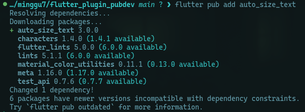

# Tugas Praktikum

## 1. Selesaikan Praktikum tersebut, lalu dokumentasikan dan push ke repository Anda berupa screenshot hasil pekerjaan beserta penjelasannya di file README.md!

### Praktikum Menerapkan Plugin di Project Flutter

#### Langkah 1: Buat Project Baru


#### Langkah 2: Menambahkan Plugin




#### Langkah 3: Buat file red_text_widget.dart

```dart
import 'package:flutter/material.dart';

class RedTextWidget extends StatelessWidget {
  const RedTextWidget({Key? key}) : super(key: key);

  @override
  Widget build(BuildContext context) {
    return Container();
  }
}

```

#### Langkah 4: Tambah Widget AutoSizeText

```dart
    return AutoSizeText(
      text,
      style: const TextStyle(color: Colors.red, fontSize: 14),
      maxLines: 2,
      overflow: TextOverflow.ellipsis,
    );
```

- Terjadi error

  - Belum import package:auto_size_text
  - Belum mendefinisikan variabel text

- Seteleah diperbarui

```dart
import 'package:auto_size_text/auto_size_text.dart';
import 'package:flutter/material.dart';

class RedTextWidget extends StatelessWidget {
  const RedTextWidget({super.key, required this.text});
  final String text;

  @override
  Widget build(BuildContext context) {
    return AutoSizeText(
      text,
      style: const TextStyle(color: Colors.red, fontSize: 14),
      maxLines: 2,
      overflow: TextOverflow.ellipsis,
    );
  }
}
```

#### Langkah 5: Buat Variabel text dan parameter di constructor

```dart
  final String text;
  const RedTextWidget({super.key, required this.text});
```

#### Langkah 6: Tambahkan widget di main.dart

```dart
Container(
   color: Colors.yellowAccent,
   width: 50,
   child: const RedTextWidget(
             text: 'You have pushed the button this many times:',
          ),
),
Container(
    color: Colors.greenAccent,
    width: 100,
    child: const Text(
           'You have pushed the button this many times:',
          ),
),
```


## 2. Jelaskan maksud dari langkah 2 pada praktikum tersebut!

Perintah `flutter pub add auto_size_text` di terminal akan mengunduh dan menambahkan plugin bernama auto_size_text ke dalam proyek flutter.

## 3. Jelaskan maksud dari langkah 5 pada praktikum tersebut!

Menambahkan properti `text` bertipe String pada widget RedTextWidget agar widget tersebut bisa menerima teks dari luar.

## 4. Pada langkah 6 terdapat dua widget yang ditambahkan, jelaskan fungsi dan perbedaannya!

1. Widget pertama

   - Berfungsi untuk mendemonstrasikan kemampuan auto-sizing teks di dalam sebuah container dengan lebar 50 pixel.
   - Perbedaan
     - ukuran font kecil.
     - 2 baris teks.
     - container berwarna kuning.
     - teks dipotong dan diakhiri tanda (...).
     - teks berwarna merah.

2. Widget kedua
   - Berfungsi untuk menampilkan teks yang sama di dalam sebuah container dengan lebar 100 pixel.
   - Perbedaan
     - ukuran font lebih besar kecil.
     - 4 baris teks.
     - container berwarna hijau.
     - teks berwarna hitam.

## 5. Jelaskan maksud dari tiap parameter yang ada di dalam plugin auto_size_text berdasarkan tautan pada dokumentasi ini !

key : Identitas unik widget.

textKey : Kunci untuk widget Text di dalamnya.

style : Gaya tulisan seperti warna, font, dan ukuran awal.

minFontSize : Ukuran font terkecil yang diizinkan.

maxFontSize : Ukuran font terbesar yang diizinkan.

stepGranularity : Langkah penurunan ukuran font saat menyesuaikan teks.

presetFontSizes : Daftar ukuran font khusus yang akan dicoba.

group : Mengelompokkan beberapa teks agar ukuran font-nya sama.

textAlign : Menentukan perataan teks (kiri, kanan, tengah, dsb).

textDirection : Arah teks (kiri ke kanan atau kanan ke kiri).

locale : Bahasa atau wilayah yang digunakan untuk format teks.

softWrap : Menentukan apakah teks boleh membungkus baris.

wrapWords : Menentukan apakah kata panjang boleh dipecah.

overflow : Menentukan tindakan jika teks tetap meluap (misal “…”).

overflowReplacement : Widget pengganti jika teks tidak muat.

textScaleFactor : Faktor pembesaran atau pengecilan teks.

maxLines : Jumlah baris maksimal teks.

semanticsLabel : Label aksesibilitas untuk pembaca layar.

## 6.Kumpulkan laporan praktikum Anda berupa link repository GitHub kepada dosen!
