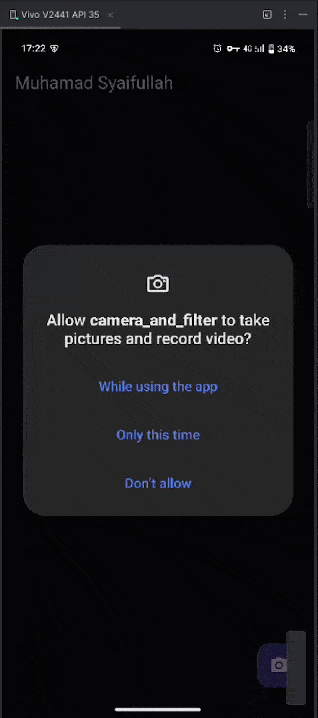

# Tugas Praktikum

## 1. Selesaikan Praktikum 1 dan 2, lalu dokumentasikan dan push ke repository Anda berupa screenshot setiap hasil pekerjaan beserta penjelasannya di file README.md! Jika terdapat error atau kode yang tidak dapat berjalan, silakan Anda perbaiki sesuai tujuan aplikasi dibuat!

### Praktikum 1: Mengambil Foto dengan Kamera di Flutter

#### Langkah 1: Buat Project Baru
Buatlah sebuah project flutter baru dengan nama kamera_flutter, lalu sesuaikan style laporan praktikum yang Anda buat.

#### Langkah 2: Tambah dependensi yang diperlukan
Anda memerlukan tiga dependensi pada project flutter untuk menyelesaikan praktikum ini.

`camera` → menyediakan seperangkat alat untuk bekerja dengan kamera pada device.
`path_provider` → menyediakan lokasi atau path untuk menyimpan hasil foto.
`path` → membuat path untuk mendukung berbagai platform.

Untuk menambahkan dependensi plugin, jalankan perintah `flutter pub add` seperti berikut di terminal:
```bash
flutter pub add camera path_provider path
```
#### Langkah 3: Ambil Sensor Kamera dari device
Selanjutnya, kita perlu mengecek jumlah kamera yang tersedia pada perangkat menggunakan plugin camera seperti pada kode berikut ini. Kode ini letakkan dalam `void main()`.

Ubah `void main()` menjadi async function seperti berikut ini.

**lib/main.dart
```dart
Future<void> main() async {
  WidgetsFlutterBinding.ensureInitialized();
  final cameras = await availableCameras();
  final firstCamera = cameras.first;
}
```
#### Langkah 4: Buat dan inisialisasi `CameraController`
Setelah Anda dapat mengakses kamera, gunakan langkah-langkah berikut untuk membuat dan menginisialisasi `CameraController`. Pada langkah berikut ini, Anda akan membuat koneksi ke kamera perangkat yang memungkinkan Anda untuk mengontrol kamera dan menampilkan pratinjau umpan kamera.

1. Buat `StatefulWidget` dengan kelas `State` pendamping.
2. Tambahkan variabel ke kelas `State` untuk menyimpan `CameraController`.
3. Tambahkan variabel ke kelas `State` untuk menyimpan `Future` yang dikembalikan dari `CameraController.initialize()`.
4. Buat dan inisialisasi controller dalam metode `initState()`.
5. Hapus controller dalam metode `dispose()`.

**lib/widget/takepicture_screen.dart
```dart
class TakePictureScreen extends StatefulWidget {  
  const TakePictureScreen({  
    super.key,  
    required this.camera,  
  });  
  
  final CameraDescription camera;  
  
  @override  
  TakePictureScreenState createState() => TakePictureScreenState();  
}  
  
class TakePictureScreenState extends State<TakePictureScreen> {  
  late CameraController _controller;  
  late Future<void> _initializeControllerFuture;  
  
  @override  
  void initState() {  
    super.initState() 
      widget.camera,   
      ResolutionPreset.medium,  
    );  
  
    _initializeControllerFuture = _controller.initialize();  
  }  
  
  @override  
  void dispose() {   
    _controller.dispose();  
    super.dispose();  
  }  
  
  @override  
  Widget build(BuildContext context) {  
    return Container();  
  }  
}
```
#### Langkah 5: Gunakan `CameraPreview` untuk menampilkan preview foto
Gunakan widget `CameraPreview` dari package `camera` untuk menampilkan preview foto. Anda perlu tipe objek void berupa `FutureBuilder` untuk menangani proses async.

**lib/widget/takepicture_screen.dart
```dart
@override  
Widget build(BuildContext context) {  
  return Scaffold(  
    appBar: AppBar(title: const Text('Muhamad Syaifullah')),  
    // You must wait until the controller is initialized before displaying the  
    // camera preview. Use a FutureBuilder to display a loading spinner until the    // controller has finished initializing.    body: FutureBuilder<void>(  
      future: _initializeControllerFuture,  
      builder: (context, snapshot) {  
        if (snapshot.connectionState == ConnectionState.done) {  
          // If the Future is complete, display the preview.  
          return CameraPreview(_controller);  
        } else {  
          // Otherwise, display a loading indicator.  
          return const Center(child: CircularProgressIndicator());  
        }  
      },  
    ),  
  );  
}
```
#### Langkah 6: Ambil foto dengan `CameraController`
Anda dapat menggunakan `CameraController` untuk mengambil gambar menggunakan metode `takePicture()`, yang mengembalikan objek `XFile`, merupakan sebuah objek abstraksi `File` lintas platform yang disederhanakan. Pada Android dan iOS, gambar baru disimpan dalam direktori cache masing-masing, dan `path` ke lokasi tersebut dikembalikan dalam `XFile`.

Pada codelab ini, buatlah sebuah `FloatingActionButton` yang digunakan untuk mengambil gambar menggunakan `CameraController` saat pengguna mengetuk tombol.

Pengambilan gambar memerlukan 2 langkah:

1. Pastikan kamera telah diinisialisasi.
2. Gunakan controller untuk mengambil gambar dan pastikan ia mengembalikan objek `Future`.

Praktik baik untuk membungkus operasi kode ini dalam blok `try / catch` guna menangani berbagai kesalahan yang mungkin terjadi.

Kode berikut letakkan dalam `Widget build` setelah field `body`.

**lib/widget/takepicture_screen.dart
```dart
@override  
Widget build(BuildContext context) {  
  return Scaffold(  
    appBar: AppBar(title: const Text('Muhamad Syaifullah')),  
    body: FutureBuilder<void>(...),  
    floatingActionButton: FloatingActionButton(  
      // Provide an onPressed callback.  
      onPressed: () async {  
        // Take the Picture in a try / catch block. If anything goes wrong,  
        // catch the error.        try {  
          // Ensure that the camera is initialized.  
          await _initializeControllerFuture;  
  
          // Attempt to take a picture and then get the location  
          // where the image file is saved.          final image = await _controller.takePicture();  
        } catch (e) {  
          // If an error occurs, log the error to the console.  
          print(e);  
        }  
      },  
      child: const Icon(Icons.camera_alt),  
    ),  
  );  
}
```
#### Langkah 7: Buat widget baru `DisplayPictureScreen
Buatlah file baru pada folder widget yang berisi kode berikut.

**lib/widget/displaypicture_screen.dart
```dart
// A widget that displays the picture taken by the user.  
class DisplayPictureScreen extends StatelessWidget {  
  final String imagePath;  
  
  const DisplayPictureScreen({super.key, required this.imagePath});  
  
  @override  
  Widget build(BuildContext context) {  
    return Scaffold(  
      appBar: AppBar(title: const Text('Muhamad Syaifullah')),
      // The image is stored as a file on the device. Use the `Image.file`  
      // constructor with the given path to display the image.      body: Image.file(File(imagePath)),  
    );  
  }  
}
```
#### Langkah 8: Edit `main.dart`
Edit pada file ini bagian `runApp` seperti kode berikut.

```dart
Future<void> main() async {  
  WidgetsFlutterBinding.ensureInitialized();  
  final cameras = await availableCameras();  
  final firstCamera = cameras.first;  
  runApp(  
    MaterialApp(  
      theme: ThemeData.dark(),  
      home: TakePictureScreen(  
        // Pass the appropriate camera to the TakePictureScreen widget.  
        camera: firstCamera,  
      ),  
      debugShowCheckedModeBanner: false,  
    ),  
  );  
}
```
#### Langkah 9: Menampilkan hasil foto
Tambahkan kode seperti berikut pada bagian `try / catch` agar dapat menampilkan hasil foto pada `DisplayPictureScreen`.

**lib/widget/takepicture_screen.dart**
```dart
// Take the Picture in a try / catch block. If anything goes wrong,  
// catch the error.  
try {  
  // Ensure that the camera is initialized.  
  await _initializeControllerFuture;  
  
  // Attempt to take a picture and get the file `image`  
  // where it was saved.  final image = await _controller.takePicture();  
  
  if (!context.mounted) return;  
  
  // If the picture was taken, display it on a new screen.  
  await Navigator.of(context).push(  
    MaterialPageRoute(  
      builder: (context) => DisplayPictureScreen(  
        // Pass the automatically generated path to  
        // the DisplayPictureScreen widget.        imagePath: image.path,  
      ),  
    ),  
  );  
} catch (e) {  
  // If an error occurs, log the error to the console.  
  print(e);  
}
```

#### Output


### Praktikum 2: Membuat photo filter carousel
#### Langkah 1: Buat project baru
Buatlah project flutter baru di pertemuan 09 dengan nama `photo_filter_carousel`

#### Langkah 2: Buat widget Selector ring dan dark gradient
Buatlah folder `widget` dan file baru yang berisi kode berikut.

**lib/widget/filter_selector.dart**
```dart
  
@immutable  
class FilterSelector extends StatefulWidget {  
  const FilterSelector({  
    super.key,  
    required this.filters,  
    required this.onFilterChanged,  
    this.padding = const EdgeInsets.symmetric(vertical: 24),  
  });  
  
  final List<Color> filters;  
  final void Function(Color selectedColor) onFilterChanged;  
  final EdgeInsets padding;  
  
  @override  
  State<FilterSelector> createState() => _FilterSelectorState();  
}  
  
class _FilterSelectorState extends State<FilterSelector> {  
  static const _filtersPerScreen = 5;  
  static const _viewportFractionPerItem = 1.0 / _filtersPerScreen;  
  
  late final PageController _controller;  
  late int _page;  
  
  int get filterCount => widget.filters.length;  
  
  Color itemColor(int index) => widget.filters[index % filterCount];  
  
  @override  
  void initState() {  
    super.initState();  
    _page = 0;  
    _controller = PageController(  
      initialPage: _page,  
      viewportFraction: _viewportFractionPerItem,  
    );  
    _controller.addListener(_onPageChanged);  
  }  
  
  void _onPageChanged() {  
    final page = (_controller.page ?? 0).round();  
    if (page != _page) {  
      _page = page;  
      widget.onFilterChanged(widget.filters[page]);  
    }  
  }  
  
  void _onFilterTapped(int index) {  
    _controller.animateToPage(  
      index,  
      duration: const Duration(milliseconds: 450),  
      curve: Curves.ease,  
    );  
  }  
  
  @override  
  void dispose() {  
    _controller.dispose();  
    super.dispose();  
  }  
  
  @override  
  Widget build(BuildContext context) {  
    return Scrollable(  
      controller: _controller,  
      axisDirection: AxisDirection.right,  
      physics: const PageScrollPhysics(),  
      viewportBuilder: (context, viewportOffset) {  
        return LayoutBuilder(  
          builder: (context, constraints) {  
            final itemSize = constraints.maxWidth * _viewportFractionPerItem;  
            viewportOffset  
              ..applyViewportDimension(constraints.maxWidth)  
              ..applyContentDimensions(0.0, itemSize * (filterCount - 1));  
  
            return Stack(  
              alignment: Alignment.bottomCenter,  
              children: [  
                _buildShadowGradient(itemSize),  
                _buildCarousel(  
                  viewportOffset: viewportOffset,  
                  itemSize: itemSize,  
                ),  
                _buildSelectionRing(itemSize),  
              ],  
            );  
          },  
        );  
      },  
    );  
  }  
  
  Widget _buildShadowGradient(double itemSize) {  
    return SizedBox(  
      height: itemSize * 2 + widget.padding.vertical,  
      child: const DecoratedBox(  
        decoration: BoxDecoration(  
          gradient: LinearGradient(  
            begin: Alignment.topCenter,  
            end: Alignment.bottomCenter,  
            colors: [  
              Colors.transparent,  
              Colors.black,  
            ],  
          ),  
        ),  
        child: SizedBox.expand(),  
      ),  
    );  
  }  
  
  Widget _buildCarousel({  
    required ViewportOffset viewportOffset,  
    required double itemSize,  
  }) {  
    return Container(  
      height: itemSize,  
      margin: widget.padding,  
      child: Flow(  
        delegate: CarouselFlowDelegate(  
          viewportOffset: viewportOffset,  
          filtersPerScreen: _filtersPerScreen,  
        ),  
        children: [  
          for (int i = 0; i < filterCount; i++)  
            FilterItem(  
              onFilterSelected: () => _onFilterTapped(i),  
              color: itemColor(i),  
            ),  
        ],  
      ),  
    );  
  }  
  
  Widget _buildSelectionRing(double itemSize) {  
    return IgnorePointer(  
      child: Padding(  
        padding: widget.padding,  
        child: SizedBox(  
          width: itemSize,  
          height: itemSize,  
          child: const DecoratedBox(  
            decoration: BoxDecoration(  
              shape: BoxShape.circle,  
              border: Border.fromBorderSide(  
                BorderSide(width: 6, color: Colors.white),  
              ),  
            ),  
          ),  
        ),  
      ),  
    );  
  }  
}
```
#### Langkah 3: Buat widget photo filter carousel
Buat file baru di folder widget dengan kode seperti berikut.

**lib/widget/filter_carousel.dart**
```dart
@immutable  
class PhotoFilterCarousel extends StatefulWidget {  
  const PhotoFilterCarousel({super.key});  
  
  @override  
  State<PhotoFilterCarousel> createState() => _PhotoFilterCarouselState();  
}  
  
class _PhotoFilterCarouselState extends State<PhotoFilterCarousel> {  
  final _filters = [  
    Colors.white,  
    ...List.generate(  
      Colors.primaries.length,  
      (index) => Colors.primaries[(index * 4) % Colors.primaries.length],  
    ),  
  ];  
  
  final _filterColor = ValueNotifier<Color>(Colors.white);  
  
  void _onFilterChanged(Color value) {  
    _filterColor.value = value;  
  }  
  
  @override  
  Widget build(BuildContext context) {  
    return Material(  
      color: Colors.black,  
      child: Stack(  
        children: [  
          Positioned.fill(child: _buildPhotoWithFilter()),  
          Positioned(  
            left: 0.0,  
            right: 0.0,  
            bottom: 0.0,  
            child: _buildFilterSelector(),  
          ),  
        ],  
      ),  
    );  
  }  
  
  Widget _buildPhotoWithFilter() {  
    return ValueListenableBuilder(  
      valueListenable: _filterColor,  
      builder: (context, color, child) {  
        // Anda bisa ganti dengan foto Anda sendiri  
        return Image.network(  
          'https://picsum.photos/id/237/200/300',
          color: color.withOpacity(0.5),  
          colorBlendMode: BlendMode.color,  
          fit: BoxFit.cover,  
        );  
      },  
    );  
  }  
  
  Widget _buildFilterSelector() {  
    return FilterSelector(onFilterChanged: _onFilterChanged, filters: _filters);  
  }  
}
```

#### Langkah 4: Membuat filter warna - bagian 1
Buat file baru di folder widget seperti kode berikut.

**lib/widget/carousel_flowdelegate.dart**
```dart
]class CarouselFlowDelegate extends FlowDelegate {  
  CarouselFlowDelegate({  
    required this.viewportOffset,  
    required this.filtersPerScreen,  
  }) : super(repaint: viewportOffset);  
  
  final ViewportOffset viewportOffset;  
  final int filtersPerScreen;  
  
  @override  
  void paintChildren(FlowPaintingContext context) {  
    final count = context.childCount;  
  
    // All available painting width  
    final size = context.size.width;  
  
    // The distance that a single item "page" takes up from the perspective  
    // of the scroll paging system. We also use this size for the width and    // height of a single item.    final itemExtent = size / filtersPerScreen;  
  
    // The current scroll position expressed as an item fraction, e.g., 0.0,  
    // or 1.0, or 1.3, or 2.9, etc. A value of 1.3 indicates that item at    // index 1 is active, and the user has scrolled 30% towards the item at    // index 2.    final active = viewportOffset.pixels / itemExtent;  
  
    // Index of the first item we need to paint at this moment.  
    // At most, we paint 3 items to the left of the active item.    final min = math.max(0, active.floor() - 3).toInt();  
  
    // Index of the last item we need to paint at this moment.  
    // At most, we paint 3 items to the right of the active item.    final max = math.min(count - 1, active.ceil() + 3).toInt();  
  
    // Generate transforms for the visible items and sort by distance.  
    for (var index = min; index <= max; index++) {  
      final itemXFromCenter = itemExtent * index - viewportOffset.pixels;  
      final percentFromCenter = 1.0 - (itemXFromCenter / (size / 2)).abs();  
      final itemScale = 0.5 + (percentFromCenter * 0.5);  
      final opacity = 0.25 + (percentFromCenter * 0.75);  
  
      final itemTransform = Matrix4.identity()  
        ..translate((size - itemExtent) / 2)  
        ..translate(itemXFromCenter)  
        ..translate(itemExtent / 2, itemExtent / 2)  
        ..multiply(Matrix4.diagonal3Values(itemScale, itemScale, 1.0))  
        ..translate(-itemExtent / 2, -itemExtent / 2);  
  
      context.paintChild(index, transform: itemTransform, opacity: opacity);  
    }  
  }  
  
  @override  
  bool shouldRepaint(covariant CarouselFlowDelegate oldDelegate) {  
    return oldDelegate.viewportOffset != viewportOffset;  
  }  
}
```

#### Langkah 5: Membuat filter warna
Buat file baru di folder widget seperti kode berikut ini.

**lib/widget/filter_item.dart**
```dart
@immutable
class FilterItem extends StatelessWidget {
  const FilterItem({super.key, required this.color, this.onFilterSelected});

  final Color color;
  final VoidCallback? onFilterSelected;

  @override
  Widget build(BuildContext context) {
    return GestureDetector(
      onTap: onFilterSelected,
      child: AspectRatio(
        aspectRatio: 1.0,
        child: Padding(
          padding: const EdgeInsets.all(8),
          child: ClipOval(
            child: Image.network(
              'https://picsum.photos/id/237/200/300',
              color: color.withOpacity(0.5),
              colorBlendMode: BlendMode.hardLight,
            ),
          ),
        ),
      ),
    );
  }
}

```

#### Langkah 6: Implementasi filter carousel
erakhir, kita impor widget `PhotoFilterCarousel` ke `main` seperti kode berikut ini.

**lib/main.dart**
```dart
void main() {
  runApp(
    const MaterialApp(
      home: PhotoFilterCarousel(),
      debugShowCheckedModeBanner: false,
    ),
  );
}
```
#### Output

## 2. Gabungkan hasil praktikum 1 dengan hasil praktikum 2 sehingga setelah melakukan pengambilan foto, dapat dibuat filter carouselnya!

## 3. Jelaskan maksud void async pada praktikum 1?
void async adalah cara untuk menjalankan fungsi main secara asinkron, yang memungkinkan Anda menunggu operasi yang memakan waktu (seperti inisialisasi kamera) selesai sebelum aplikasi berjalan.
## 4. Jelaskan fungsi dari anotasi @immutable dan @override ?
* @immutable: Anotasi ini menandakan bahwa sebuah class dan semua subclass-nya tidak dapat diubah (immutable). Artinya, semua properti/variabel di dalam class tersebut harus final, dan setelah objek dari class itu dibuat, nilainya tidak bisa diubah lagi. Ini sangat umum digunakan pada Widget di Flutter untuk optimasi performa, karena jika state sebuah widget tidak berubah, Flutter tidak perlu membangunnya kembali.
* @override: Anotasi ini digunakan pada sebuah method di dalam subclass untuk menandakan bahwa method tersebut sengaja menimpa (mengganti implementasi) method dengan nama yang sama dari superclass (class induknya). Ini membantu mencegah kesalahan; jika Anda salah mengeja nama method atau jika method di superclass berubah nama atau dihapus, compiler akan memberikan error.
## 5. Kumpulkan link commit repository GitHub Anda kepada dosen yang telah disepakatist!

